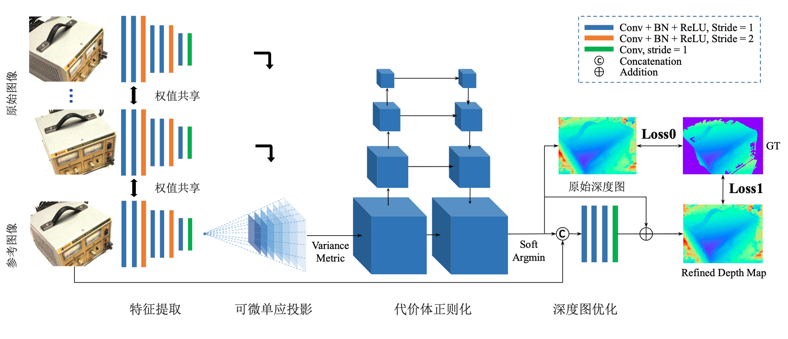

# 第三章 多视点三维重建

​	本章将详细介绍现阶段多视点深度估计和三维重建中几种优秀的方法，这些方法从相似角度阐述多视点三维重建问题，但依照的原理和实现的方法各有特点。本章将首先介绍北卡罗来纳大学教堂山分校和苏黎世联邦工业大学于2016年提出基于传统计算机视觉的Colmap方法，该方法在公开数据集榜单上一直取得很好的成绩，后人在此基础上又增加了一些计算机视觉和图像处理的方法，使其成为传统方法中的标杆。在第二部分介绍2018年由香港科技大学权龙教授团队打造的基于深度学习解决MVS问题的开山之作MVSNet，该方法问世之后在Tanks and Temples数据集上一举取得了最好成绩，甚至超过很多传统算法，后人在此基础上不断发展，逐步开始了依靠深度学习技术解决MVS问题的大方向。

​	本章还将基于两种经典的方法和其他工作进行多视点三维重建应用无监督深度学习方法的理论基础铺垫，并为第4章的算法实现打下基础。

 

## 3.1 传统计算机视觉Colmap方法

### 3.1.1 概述

​	基于传统计算机视觉的多视点三维重建方法Colmap的流程图如图3.1所示。

> 图3.1 Colmap算法流程图

​	接下来的两小节将依次介绍Colmap方法的核心流程，包括稀疏重建、深度图估计、稠密重建；以及Colmap方法的创新点和主要贡献，包括场景图改进与增强、后续最优帧的选择、鲁棒的三角化、BA优化。

### 3.1.2 核心流程

**A. 稀疏重建**

​	MVS问题的第一个步骤是要从输入图像中提取特征点并进行匹配，Colmap通过增量式建模恢复场景的稀疏三维结构及相机位姿，其流程图如图3.2所示。

> 图3.2 Colmap稀疏重建流程图

​	特征提取主要使用常用的特征提取算子，如SIFT进行提取。提取后的图像特征点经过多视点的特征点匹配算法进行特征匹配，以生成场景图（Scene Graph）和匹配矩阵（Matching Matrix）。之后采用增量式的SfM算法逐步增加视角迭代地优化重投影误差，确定不同视图和点云间的可视关系，并得到场景中的相机位姿和表示场景结构的稀疏点云。

​	增量式SfM采用迭代的算法逐步优化稀疏重建结果，其算法流程如下

（1）对无序图像进行特征匹配和三角测量以初始化

（2）通过已有点云重新估计相对相机位姿

（3）进行全局和局部的BA优化

（4）增量添加视角，再次进行三角测量和相机位姿估计

（5）再进行BA优化修正结果

**B. 深度图估计**

​	多视点三维重建通过深度估计算法恢复参考图像中的像素深度信息，在Colmap中使用GEM模型进行求解。深度图估计主要包括四个步骤，如图3.3所示。

（1）在原始图像中筛选与参考图像配对一同计算视差的候选集

（2）迭代计算参考图像上每个特征对应的匹配代价

（3）将代价进行聚合以计算深度值

（4）最后通过深度过滤进行深度图优化

> 图3.3 Colmap深度图估计流程

​	Colmap使用NCC作为图像间的光学一致性度量，特征$l$的最优深度$\theta_l^{opt}$和最优化拟合平面的法向量$n_l^{opt}$满足公式3.1。
$$
(\theta_l^{opt}, n_l^{opt}) = argmin_{\theta_l,n_l} \sum_{i=1}^N P_{l}(i)(1 - NCC_l^i)
$$
​	然后利用图像块匹配（Patch Match）[22]信息传递策略进行代价累计，公式3.1被修改为
$$
(\theta_l^{opt}, n_l^{opt}) = argmin_{\theta_l,n_l} \frac{1}{\vert A \vert} \sum_{i \in A} \xi_l^i
$$
​	由于深度开始时被随机初始化，对于纹理缺少的区域或光滑表面等，通过Patch Match方法进行船体可能因无法准确获取深度信息而残留碎挤汁，因此造成初始深度图的不光滑。因此再利用光学一致性和几何一致性约束对初始深度图进行过滤，也即达到对视角进行平滑。在原论文中，作者引入判据$q$，如果满足$q(Z_l^i) > \bar {q_Z}$且$q(\alpha_l^i) > \bar {q_\alpha}, q(\beta_l^i) > \bar {q_\beta}, q(\gamma^i) > \bar {q_\gamma}$，则表征特征$l$在代表$i$上的对应像素$x_l^i$是在多视图间稳定的，即多视图之间是几何稳定的。

C. 稠密重建

​	最后利用深度图配准原理融合深度图，进行稀疏点云的稠密恢复，计算公式如公式3.3所示
$$
z\left[\begin{array}{l}
u \\
v \\
1
\end{array}\right]=P \cdot p^{w}=K(R \mid t) p^{w}
$$

### 3.1.3 创新点与主要贡献

​	本节将对Colmap的上述步骤进行补充，主要围绕Colmap方法的核心特性、创新点和主要贡献展开，也希望借此启发笔者对于无监督多视点三维重建算法的实现。

**A. 场景图改进与增强**

​	Colmap采用多模型几何验证策略用于增强场景图，对于输入的一组图像对，具体操作流程如下：

（1）计算基础矩阵$F$及内点数，若内点数大于$N_F$，则认定图像对通过几何校验

（2）计算单应矩阵$H$及内点数$N_H$，若$\frac{N_H}{N_F} < \varepsilon_{HF}$，则代表相机因发生移动而造成纯旋转假设估计的效果不理想，此时认定该场景为常规场景（General Scene）

（3）计算已标定相机的本质矩阵$E$和内点数$N_E$，若$\frac{N_E}{N_F} > \varepsilon_{EF}$，则代表相机标定参数符合要求，此时可分解本质矩阵$E$得到相机位姿，并对点进行三角化处理，计算三角化点点平均角度$\alpha_m$用以区分纯旋转（Pure Rotation，也称作Panoramic）和平面（Planar Scenes，也称作Planar）特征

​	综上，Colmap根据假设条件，通过统计几何校验的内点数判断模型的类型。

**B. 后续最优帧的选择**

​	参与下一步重建的图像对的选择对相机位姿估计、三角化精度硬系那个是非常大的，因此进一步影响重建效果。通常选取能使得三角化点数量最多的图像，即能观察到最多场景像素的图像作为后续的最优帧，但V. Lepetit[23]等人通过实验验证PnP位姿计算精度不仅与观测到场景中点的数量相关，而且与观测到场景中点在图像中点分布有关，且点分布越均匀，相机位姿计算精度越精确。

​	Colmap采用的方法如图3.4所示，将每张图像划分成$L$层，每层划分为$K_l^2$个格子，每个格子中用空和满表示，当某一个格子中点变为可见时，该格子被标记为满，该图像点评分权重随即增加，最后统计可见点在每层中的得分并累加。可见点在相同数量的情况下，分布越均匀得分越高。

> 图3.4 Colmap后续最优帧选择中不同点的分布与得分关系示意图

**C. 鲁棒的三角化**

​	由于场景中的点不能被持续观测，因而特征追踪可能因此导致错误匹配，进而导致后续的三角化发生错误，因此Colmap使用RANSAC对多帧观测的图像进行三角化。能够进行三角化的点$X_{ab}$计算方法如公式3.x所示，其中$\tau$可采用任意三角化方法，在Colmap中使用DLT三角化法[24]。
$$
\mathbf{X}_{a b} \sim \tau\left(\overline{\mathbf{x}}_{a}, \overline{\mathbf{x}}_{b}, \mathbf{P}_{a}, \mathbf{P}_{b}\right) ,  a \neq b
$$
​	计算得到的三角化点$X_{ab}$还需要满足两个条件才可被判定为鲁棒的三角化点

（1）三角化角度足够大，其计算结果如下
$$
\cos \alpha=\frac{t_{a}-X_{a b}}{\left\|t_{a}-X_{a b}\right\|_{2}} \cdot \frac{t_{b}-X_{a b}}{\left\|t_{b}-X_{a b}\right\|_{2}}
$$
（2）三角化点深度非负，且重投影误差小于设定的阈值$t$

**D. BA优化**

​	Colmap在tx选取及三角化后通过BA优化消除累计误差，且由于增量式重建仅会影响相邻帧，所以不需要每轮迭代都进行全局BA优化。BA优化主要包括四个核心点。

（1）局部BA优化主要是用柯西核函数处理外点，但当视点数量增加，也可以使用PCG求解器处理

（2）BA优化后，相机位姿发生了改变，因此需要再次删除重投影误差较大的观测，并检查几何校验是否仍然保持

（3）由于相机位姿的优化，使得之前无法三角化的点可能在准确位姿估计下进行三角化，因此在BA优化后要进行重三角化（post Re-Triangulation，简称post RT）

（4）上述BA优化和重三角化需要迭代进行不断优化

 

## 3.2 有监督深度学习MVSNet方法

### 3.2.1 概述

​	MVSNet是端到端的有监督深度学习多视点深度图推断方法，MVSNet方法主要包括四个主要流程，其主要流程及网络架构如图3.5所示。

>  图3.5  MVSNet主要流程及网络架构

（1）利用CNN网络提取视觉图像特征

（2）通过可微单应投影变换（differentiable homography warping）和基于方差的成本度量（variance-based metric），依据视点的相机视锥构建3D代价体

（3）使用三维卷积对代价体进行正则化，回归生成原始深度图

（4）通过参考图像对深度图进行优化以提升边界区域的准确性

​		接下来的两小节将依次介绍MVSNet方法的核心流程，包括图像深度特征提取、匹配代价的构建与聚合、深度估计和深度图优化、损失函数构建；以及MVSNet方法的部分实现细节和总结。

### 3.2.2 核心流程

**A. 图像深度特征提取**

​	第一个关键步骤与Colmap等传统方法相似，都需要对$N$张输入图像$\{ I_i\}^N_{i=1}$提取特征，并得到$N$个深度特征图$\{ F_i\}^N_{i=1}$，用于后续的投影和匹配，但是基于深度学习的方法采用八层的2D CNN网络从图像中提取有关深度线索的高级特征。2D CNN网络的每个尺度有两个卷积层，除最后一层外每个卷积层由批归一化层（Batch-Normalization，简称BN）和线性整流函数（Rectified Linear Unit，简称ReLU）组成，第三层和第六层的卷积步长为2，用以得到三个尺度的特征图，且各参数在特征提取网络中全局共享，用于更高效的进行训练和学习。

​	2D CNN的输出时$N$维32通道的特征图，与输入图像相比，每个维度缩小4维。虽然经过特征提取之后图像帧进行了如此的下采样，但这些被剔除掉的像素的原始近邻信息已经被编码到32通道的像素级描述子中，在密集匹配中不会丢失对学习有意义的上下文信息。

​	作者在后续实验中证明，与直接进行简单密集匹配相比，通过提取出的高级深度特征显著地提升了重建的质量。

**B. 匹配代价构建与聚合**

​	第二个步骤将提取出的高级深度特征图与相机参数融合用以构建3D代价体，传统方法时使用标准网格划分空间，但是并没有充分利用相机属性和对极几何背景知识，在MVSNet中，采用基于参考相机视锥体的方式进行代价体的构建，其中相机视锥体示意图如图3.6所示。

> 图3.6 相机视锥体示意图

​	再通过投影操作，即可连接二维特征与三维正则化网络，MVSNet中采用可微单应投影变换进行计算，以实现深度图推理的端到端训练。所有特征图都被影射到参考相机不同的前平行平面，以组成$N$个特征体$\{V_i\}^N_{i=1}$，通过投影变换，将某个深度图以深度$d$从$V_i(d)$影射到$F_i$，记$H_i(d)$为第$i$张特征图与参考特征图在深度$d$的投影，$n_1$为参考相机的主轴，投影矩阵$H_i(d)$计算公式由公式3.7描述。投影过程与经典的平面扫描算法类似[4]，取而代之的是在可微的双线性插值时从特征图$\{F_i\}^N_{i=1}$中采集像素，而不是原始图像$\{I_i\}^N_{i=1}$。
$$
\mathbf{H}_{i}(d)=\mathbf{K}_{i} \cdot \mathbf{R}_{i} \cdot\left(\mathbf{I}-\frac{\left(\mathbf{t}_{1}-\mathbf{t}_{i}\right) \cdot \mathbf{n}_{1}^{T}}{d}\right) \cdot \mathbf{R}_{1}^{T} \cdot \mathbf{K}_{1}^{T}
$$
​	将多重特征体$\{V_i\}^N_{i=1}$聚合为一个代价体$C$，为适应任意数量视点的输入，MVSNet提出了基于方差的代价度量指标$\mathcal{M}$，用以度量$N$个视点的相似性。最终代价体的尺寸为
$$
V = \frac{W}{4} \cdot \frac{H}{4} \cdot D \cdot F
$$
​	其中$W,H,D,F$分别代表输入视点图像的宽度、高度、深度样本数以及特征图通道数。由上，代价度量指标$\mathcal{M}$计算公式为
$$
\mathbf{C}=\mathcal{M}\left(\mathbf{V}_{1}, \cdots, \mathbf{V}_{N}\right)=\frac{\sum_{i=1}^{N}\left(\mathbf{V}_{i}-\overline{\mathbf{V}}_{i}\right)^{2}}{N}
$$
​	传统MVS方法通过启发式的方法计算参考图像和原始图像间的损失，Hartmann, W.[26]等人提出的方法中认为所有视图都应该平等地贡献匹配样本，并且不必优先考虑参考图像，因此直接对多个CNN层取平均值来得到多布丁相似度（Multi-Patch Similarity）。然而在MVSNet中认为均值操作本身没有提供关于特征差异的任何信息，并且需要附加预处理和后处理CNN层协助推断相似性，MVSNet将其进行改进，通过计算方差的操作明确地衡量多视图特征的差异。

> 图3.7 代价体正则化网络结构

​	在代价体正则化阶段，MVSNet又将代价体$C$进一步转换为概率体$P$，以消除图像特征提取构建代价体阶段可能存在的噪声问题，并结合平滑约束以推断深度图。MVSNet中采用多尺度的3D CNN用于代价体的正则化，参考UNet[27]作为启发，构建3D版本的编码器-解码器结构，以相对低的内存和计算资源从一个较大的感受野中聚集邻域信息，如图3.7所示。概率体不仅可用于像素级的深度估计，还可用于表征深度估计的置信度，最后沿深度方向应用softmax运算进行概率归一化以完成代价体正则化。

**C. 深度估计和深度图优化**

​	从概率体$P$中提取深度图$D$一般采用第2章介绍过的赢家通吃算法，但无法进行亚像素级的估计，且由于其不可微性，无法在神经网络中用于反向传播训练。MVSNet沿梯度方向计算期望值，例如使用公式3.9计算所有假设概率的加权和，该方法与WTA算法如argmax结果相似，，且结果完全可微。
$$
D = \sum_{d = d_{min}}^{d_{max}} d \times P(d)
$$
​	沿深度方向的概率分布也反映出深度估计的质量。尽管3D CNN有一定程度上的正则化能力，但是得到的概率分布仍然是分散的，不能集中到单峰，如图3.8所示。MVSNet定义深度估计的质量$\hat d$作为估计得到的深度值在真值附近的概率，且可以作为后续控制离群点滤波时的阈值参数。

> 图3.8 预测深度图、概率分布和概率图的说明

​	通过概率体恢复得到的深度图可能由于正则化时使用过大的感受野而造成过于平滑。可以采用参考图像自身所携带的边缘信息指导深度图的优化，在MVSNet的末端添加了深度残差学习网络（Depth Residual Learning Network）。原始深度图和统一尺寸后的原始图像聚合后形成四通道输入，然后经过三个32通道的2D卷积层和一个单通道的卷积层学习深度残差。最后结合原始深度图一同生成优化后的深度图。

**D. 损失函数构建**

​	综合原始深度图和优化后的深度图，使用深度图的真值和估计值的平均绝对误差作为训练误差，MVSNet通过公式3.y定义损失函数，由于前文提到在数据集真值的采集中无法做到逐点的完全精准，因此这里只考虑$p \in p_{valid}$即有确定标签的像素计算损失函数。
$$
\text { Loss }=\sum_{p \in \mathbf{p}_{\text {valid }}} \underbrace{\left\|d(p)-\hat{d}_{i}(p)\right\|_{1}}_{\text {Loss } 0}+\lambda \cdot \underbrace{\left\|d(p)-\hat{d}_{r}(p)\right\|_{1}}_{\text {Loss } 1}
$$

### 3.2.3 部分实现细节与总结

​		基于有监督的深度学习MVS方法在大型室内数据集DTU上进行训练和测试，在完整性和准确度上都超过之前最好的方法，由于深度学习算法的特点，在运算速度上比传统方法加速几倍甚至几个数量级。不仅如此，MVSNet还在复杂的室外数据集Tanks and Temples上进行测试，在榜单上位列第一且没使用任何微调手段，足见其泛化能力。

​		视角选择方面MVSNet在训练时设定$N=3$，即选定一张参考图像和两张原始图像作为输入，但在测试时可以自由的设定任意数量的视角数$N$。MVSNet在实现时可以选择是否在最后进行深度图过滤后处理，并设定了光度一致性与几何一致性两种程度的验证方式，这也对后续无监督深度学习方法提供了很多借鉴意义。光度一致性滤波表征匹配质量；几何一致性表征多视角中的深度一致性，将参考图像像素点$p_1$处的深度值$d_1$投影到邻域图像中的$p_i$处，然后再将$p_i$在其深度值$d_i$处重投影至参考图像$p_{reproj}$处，此时的深度估计为$d_{reproj}$，如果满足$\vert p_{reproj} - p_1 \vert < 1$且$\frac{\vert d_{reproj} - d_1 \vert}{d_1} < 0.01$，则两视点满足几何一致性。通过上述两步滤波可以充分滤除多种类型的离群值，为算法带来很大程度上的鲁棒性提升。

​		综上，MVSNet作为基于深度学习的多视点深度估计和三维重建的开山之作，充分总结完善前人积淀，编码相机参数作为可微单应投影，并结合图像信息构建代价体，同时嫁接了2D图像特征与3D损失回归的深度学习神经网络。为后续工作充分利用深度学习技术改进MVS问题的求解打下了良好的基础。笔者也将使用MVSNet作为模板，将其融入无监督深度学习的特性进一步完善。

