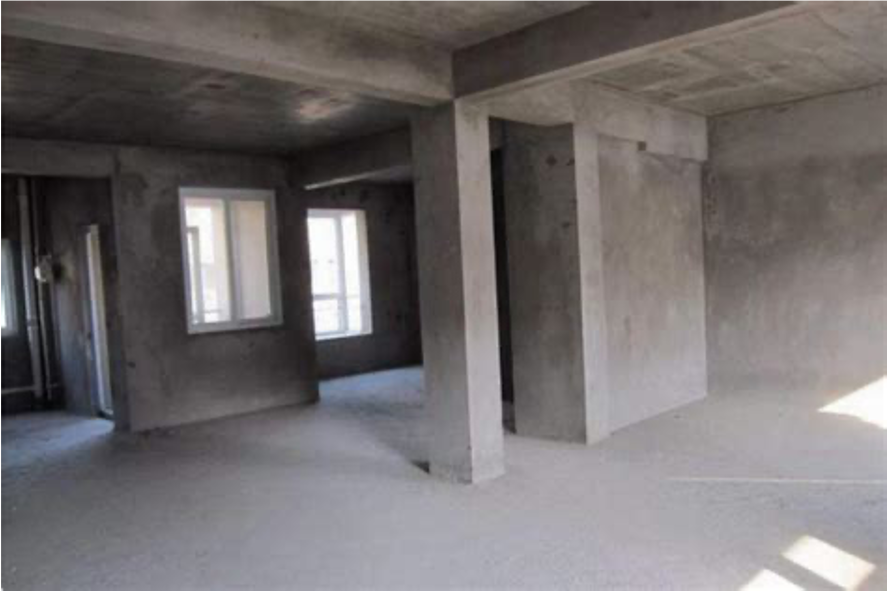
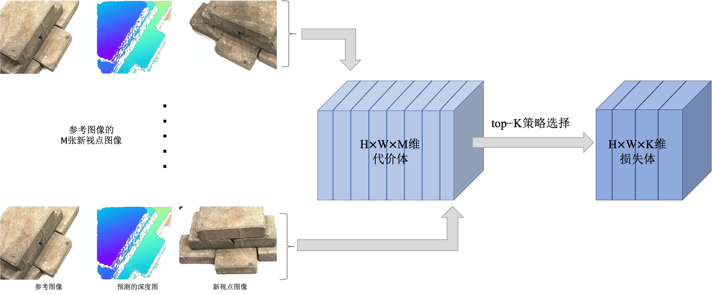

# 第四章 无监督深度学习算法实现

* [4.1 算法概述](#41-算法概述)
* [4.2 光度一致性](#42-光度一致性)
   * [4.2.1 传统的光度一致性](#421-传统的光度一致性)
   * [4.2.2 鲁棒的光度一致性](#422-鲁棒的光度一致性)
* [4.3 无监督损失函数](#43-无监督损失函数)
* [4.4 深度学习网络架构](#44-深度学习网络架构)

------

​	本章将在第3章基础上总结Colmap方法和有监督学习多视点三维重建方法的核心思想，以及前人在基于无监督学习的单视点、双视点及多视点三维重建的尝试，进一步完善基于无监督深度学习的多视点三维重建方法。

​	本章将首先介绍无监督学习方法的概述，并围绕鲁棒的光度一致性、无监督损失函数及深度学习网络架构展开，最后将就算法实现中的细节展开介绍。

 

## 4.1 算法概述

​	无论是有监督学习还是无监督学习MVS，当前的方法主要利用的是潜在的几何一致性与光度一致性，即保证在深度方向将图像中的每个像素投影到参考图像中，判断是否能正确匹配。这些约束能够独立分析各个场景的信息但不能很好的归纳使用整个空间的一般先验知识，尤其是在场景中特征比较稀疏或表面材质缺失情况尤为严重。而对于土木工程场景，大量的地面、墙面及其他施工场景极难提取特征，如图4.1所示。

> 图4.1 特征稀疏的土木工程场景示意图

​	为克服上述问题，尤其是针对土木工程场景传统计算机视觉特征缺失的问题，基于深度学习的方法，尤其是训练CNN网络跨视图提取和合并深层次深度信息的方法，如3.2节介绍的MVSNet方法，极大程度的改善了这个问题并提出了有效的多视点深度估计和三维重建的深度学习方法。但如1.3.1节提到的土木工程场景面临的问题，这些方法强烈依赖场景的真值，对于土木工程场景这类监督目标过于繁重的任务很难奏效。

​	无监督学习方法MVS克服有监督学习方法MVS强烈依赖场景3D真值作为训练数据的核心障碍，利用多个不同的视角间的光度一致性作为监督信号进行训练，通过正确地处理光度一致像素的重投影问题，最小化重投影误差以训练CNN网络。但如果只简单使用图像间的光度一致性作为衡量，很可能受到如2.1.3节指出问题的影响，这其中最主要的是遮挡（occlusion）和不同视角间光度变换的影响。

​	因此笔者主要做出两部分尝试

（1）光度损失梯度一致性：实验中发现，仅保证像素维度上的一致性很可能受到光照、噪声等影响，但如果在梯度维度上也保证光度一致性则可以大幅度的增强约束力

（2）鲁棒的光度损失：实验中发现，对于某一张参考图像中的像素很有可能在一些原始图像中处于被遮挡的位置而光度不可感知，换言之，某一个特定的像素点不需要在所有其他视图中都保持光度一致，只需在没被遮挡的地方计算重投影误差；通过鲁棒的光度一致性选择性地加强与某些视图的光度一致性即可隐式地处理遮挡问题造成的影响

​	因此，无监督学习多视点三维重建方法仍然以一张参考图像和几张原始图像组成的一组图像，以及预先通过SfM算法求解出的相机内参与外参作为输入，与有监督学习MVS不同之处在于不需要3D场景的真值。利用梯度一致性光度一致和鲁棒的光度损失作为误差训练CNN网络。对于每一张参考图像估计像素级的深度图并进行优化调整，再通过后处理将深度图融合成点云。

 

## 4.2 光度一致性

### 4.2.1 传统的光度一致性

​	光度一致性在单目和双目深度估计中被证明发挥出强有力的作用\[28][29]。其思想可简要概括为通过预测深度图建立原始图像和参考图像的对应关系，并通过单应变换实现正向和逆向的投影，如果投影前后的像素距离在合适的范围内，则认为这组图像在该像素位满足光度一致性要求。

​	在传统的光度一致性度量中，设原始图像为$I_s$，附加的$M$个新视点输入图像记为$\{I_v^m\}$，这些图像被用来作为原始图像$I_s$的参考，用于预测深度图$D_s$。当给定相机参数$(K,T)$后，对于一个视点对$(I_s, I_v^m)$，可以通过预测得到的深度图$D_s$实现逆投影（inverse-warp），即可以将$M$个新视点的图像中的像素投影到原始图像$I_s$中。这里使用M. Jaderberg等人提出的空间转换网络（Spatial Transformer Network）[30]进行处理，通过可微的双线性插值将新视点$I_v^m$进行投影得到$\hat{I_s^i}$。对于原图$I_s$中的某个像素$u$，可以通过单应投影变换得到在投影图像中的新坐标，如公式4.1所示
$$
\hat{u} = K T (D_s(u) \cdot K^{-1} u)
$$
​	通过对投影坐标周围的新视点图像进行双线性插值，得到投影后的图像
$$
\hat I_s^m(u) = I_v^m(\hat u)
$$
​	同时生成了一个二元验证的图像掩膜（mask），由于新视点视图中有些像素在投影后会位于边界之外，所以通过mask可以表征投影后视图中有效的像素。通过设定投影图像和原图像的匹配关系，可以指定光度一致性目标的损失函数为
$$
L_{p h o t o}=\sum_{m}^{M}\left\|\left(I_{s}-\hat{I}_{s}^{m}\right) \odot V_{s}^{m}\right\|
$$

### 4.2.2 鲁棒的光度一致性

​	传统的光度一致性在单目或双目的实践中起到比较好的指导效果，例如在KITTI数据集[4]上进行训练得到理想的效果。但MVS与单目或双目重建存在很大的不同，单目或双目重建的数据普遍只有很少的遮挡或光照变化，甚至对于单目重建问题来说，这些问题根本不存在。但对于MVS数据集而言，由于视点的增多在时间上有连续性，因此自遮挡、光照变换、反射、阴影等对结果的影响非常之大。

​	笔者采用两种策略改进光度一致性约束。

**A. 基于图像梯度构建光度一致性**

​	相较于图像像素本身的光度一致性，图像像素梯度的差异有更强的约束力，因此采用图像像素和图像梯度差异融合的匹配成本进行光度一致性的衡量。公式4.4被做如下修改
$$
L_{\text {photo }}=\sum_{m=1}^{M}\left\|\left(I_{s}-\hat{I}_{s}\right) \odot V_{s}^{m}\right\|+\alpha \left\|\left(\nabla I_{s}-\nabla \hat{I}_{s}^{m}\right) \odot V_{s}^{m}\right\|
$$
​	在实现中取$\alpha = 1$。

**B. 考虑遮挡关系**

​	MVS中的遮挡问题是单目或双目深度估计与三维重建中不存在的，如图4.2所示。对于目标像素$T$，只有在参考视点、新视点3和新视点4中可见，而对于视点1和视点2的同样深度尺度得到的像素分别为$T'_1$和$T'_2$。因此如果使用所有视点进行上述光度一致性检验在很大程度上有失偏颇，但如果使用诸如聚类的方法将上述五个视点进行二分聚类确实可以更加精确的选取不存在遮挡的视点，很可能随着视点增多而变得臃肿，进而影响MVS算法的整体性能与复杂度。

> 图4.2 MVS中的遮挡问题示意图

​	笔者参考其他成熟算法，通过设定$top-K$简单直观的处理遮挡问题。对于新视点$I_m^i$中的某个像素$u$，令它的梯度光学一致性为$L^m(u)$。对于每个像素$u$，在像素投影的有效视图中，只取前$K$个光度一致性最好的不相交视图用以计算损失。鲁棒的光度一致性可由公式4.5表示。
$$
L_{\text {photo }}=\sum_{u} \min _{m_{1}, \cdots, m_{K} \\ m_{i} \neq m_{j} \\ V_{s}^{m_{k}}(u)>0} \sum_{m_{k}} L^{m_{k}}(u)
$$

 

## 4.3 无监督损失函数

​	依照4.2节描述的鲁棒的光学一致性损失函数进行实验，发现存在场景部分重建缺失以及边缘不够平滑等问题。参考R. Mahjourian等人在2018年提出的3D几何约束[29]中提到的图像块级别的结构化相似性损失（Structural Similarity，简称SSIM）和深度图梯度感知平滑损失（简称Smooth），对损失函数进一步优化。

​	两个图像块间的SSIM可由公式4.6表示，其中$\mu$代表局部平均值，$\sigma$代表方差。越高的SSIM值代表二者在结构相似度越高，可通过此更加完整的进行场景中缺失部分的重建。
$$
S S I M(x, y)=\frac{\left(2 \mu_{x} \mu_{y}+c_{1}\right)\left(2 \sigma_{x y}+c_{2}\right)}{\left(\mu_{x}^{2}+\mu_{y}^{2}+c_{1}\right)\left(\sigma_{x}+\sigma_{y}+c_{2}\right)}
$$
​	SSIM对应的损失函数可以描述为公式4.7，其中$M_s^{ij}$代表一个图像掩膜，用于剔除掉投影后在原始图像边界外的像素，以改善边界附近的深度预测。且处于性能的考虑，在具体实现中只考虑参考图像和$top-K$选择中鲁棒光度一致性最高的两个图像进行SSIM损失的求解。
$$
L_{S S I M}=\sum_{i j}\left[1-S S I M\left(I_{s}^{i j}, I_{s}^{\hat{i} j}\right)\right] M_{s}^{i j}
$$
​	平滑损失使得在训练时加强平滑因子的激励信号，尤其是对于图像边缘的平滑，其计算公式如下。
$$
L_{\text {Smooth }}=\sum_{i j}\left\|\nabla_{x} D^{i j}\right\| e^{-\left\|\nabla_{x} I^{i j}\right\|}+\left\|\nabla_{y} D^{i j}\right\| e^{-\left\|\nabla_{y} I^{i j}\right\|}
$$
​	综上我们构建了鲁棒的光学一致性度量，并参考成熟3D几何约束增加了结构相似度SSIM和深度平滑损失，最终的损失函数为上述三者的加权平均。
$$
L = \sum \alpha L_{photo} + \beta L_{SSIM} + \gamma L_{Smooth}
$$

## 4.4 深度学习网络架构

​	主体网络架构参考第3章图3.5所示的MVSNet网络架构，核心要处理的是在没有场景深度真值的情况下进行损失函数的表达。

​	输入的原始图像首先经过特征提取2D CNN网络提取深度图像特征，CNN网络共由8层组成，每一次卷积操作之后都首先通过BN层和ReLU层，直至倒数第二层，最后一层则对每张输入的原属图像进行缩减4个维度的下采样，得到32通道的特征图，同样的，网络权值在所有图像中共享。

​	得到特征图后，即可用公式3.6所示的可微单应投影变换，将特征图按照128个深度值投影到参考相机不同的正平行平面中，且对于每一个原始图像生成一个代价体。接下来使用基于方差的成本度量将所有代价体聚集成一个代价体。同样的，相较于不可微的赢家通吃策略argmax操作，使用三层的3D UNet细化代价体及平滑深度值变换，将原始估计的深度图沿深度通道进行argmin操作，以达到亚像素精度的代价体聚集。通过此操作金光构建代价体的深度值是离散的，但得到的深度图遵循连续分布，且由于其可微性，更利于后续训练。

​	由于在无监督学习策略上采用鲁棒的光度一致性作为损失计算方法，并通过$top-K$策略处理遮挡问题的影响，因此通过得到的原始深度图将聚合的代价体做无监督学习策略的调整，如图4.3所示。参考图像和$M$张新视点图像通过预估计的深度图按照公式4.4所示进行投影变换得到$M$张误差图，并进行聚合得到$H \times W \times M$维的代价体。再通过$top-K$策略从$M$张深度图中选取$K$个误差最小的图像取均值以计算最终鲁棒的光度损失。

> 图4.3 无监督学习中鲁棒的光度一致性与$top-K$策略的架构

​	输出的代价体中深度分布可能由于离群值而造成非单峰情况，通过建立深度估计质量$\hat d$进行剔除和选择，将四个最邻近深度估计的值进行概率累加，然后通过阈值滤波得到优化后的深度图并作为输出代价体的图像掩膜。

​	最后通过参考图像自身所携带的边缘信息进行深度图过于平滑的处理，将预测的深度图和原始图像一同通过四层的CNN网络，得到深度残差图，再将其与初始估计的深度图加权融合即可得到最终的深度图。

