# 基于无监督深度学习的土木工程场景三维重建

   * [基于无监督深度学习的土木工程场景三维重建](#基于无监督深度学习的土木工程场景三维重建)
   * [摘要](#摘要)
   * [ABSTRACT](#abstract)
   * [第一章 引言](#第一章-引言)
      * [1.1 研究背景及意义](#11-研究背景及意义)
         * [1.1.1 土木工程场景三维重建的研究背景与价值](#111-土木工程场景三维重建的研究背景与价值)
         * [1.1.2 无监督深度学习在该领域的应用价值](#112-无监督深度学习在该领域的应用价值)
      * [1.2 研究现状](#12-研究现状)
      * [1.3 挑战与目标](#13-挑战与目标)
         * [1.3.1 土木工程场景三维建模面临的问题和挑战](#131-土木工程场景三维建模面临的问题和挑战)
         * [1.3.2 本文研究内容](#132-本文研究内容)
      * [1.4 论文结构安排](#14-论文结构安排)
   * [第二章 理论基础](#第二章-理论基础)
      * [2.1 三维重建基础知识](#21-三维重建基础知识)
         * [2.1.1 对极几何](#211-对极几何)
         * [2.1.2 单应变换](#212-单应变换)
         * [2.1.3 平面扫描](#213-平面扫描)
         * [2.1.4 立体匹配](#214-立体匹配)
      * [2.2 深度学习方法基础知识](#22-深度学习方法基础知识)
         * [2.2.1 卷积神经网络](#221-卷积神经网络)
         * [2.2.2 无监督深度学习](#222-无监督深度学习)
   * [第三章 多视点三维重建](#第三章-多视点三维重建)
      * [3.1 传统计算机视觉Colmap方法](#31-传统计算机视觉colmap方法)
         * [3.1.1 概述](#311-概述)
         * [3.1.2 核心流程](#312-核心流程)
         * [3.1.3 创新点与主要贡献](#313-创新点与主要贡献)
      * [3.2 有监督深度学习MVSNet方法](#32-有监督深度学习mvsnet方法)
         * [3.2.1 概述](#321-概述)
         * [3.2.2 核心流程](#322-核心流程)
         * [3.2.3 部分实现细节与总结](#323-部分实现细节与总结)
   * [第四章 无监督深度学习算法实现](#第四章-无监督深度学习算法实现)
      * [4.1 算法概述](#41-算法概述)
      * [4.2 光度一致性](#42-光度一致性)
         * [4.2.1 传统的光度一致性](#421-传统的光度一致性)
         * [4.2.2 鲁棒的光度一致性](#422-鲁棒的光度一致性)
      * [4.3 无监督损失函数](#43-无监督损失函数)
      * [4.4 深度学习网络架构](#44-深度学习网络架构)
   * [第五章 实验结果与评估](#第五章-实验结果与评估)
      * [5.1 实验环境与数据集简介](#51-实验环境与数据集简介)
         * [5.1.1 实验环境](#511-实验环境)
         * [5.1.2 实验数据集](#512-实验数据集)
      * [5.2 实验结果](#52-实验结果)
         * [5.2.1 DTU数据集上重建的效果](#521-dtu数据集上重建的效果)
         * [5.2.2 Tanks and Temples数据集上重建的泛化效果](#522-tanks-and-temples数据集上重建的泛化效果)
      * [5.3 消融实验](#53-消融实验)
         * [5.3.1 误差项的影响](#531-误差项的影响)
         * [5.3.2 遮挡视点剔除的影响](#532-遮挡视点剔除的影响)
      * [5.4 实验评估](#54-实验评估)
         * [5.4.1 定性评估](#541-定性评估)
         * [5.4.2 定量评估](#542-定量评估)
   * [第六章 总结与展望](#第六章-总结与展望)
      * [6.1 本文工作总结](#61-本文工作总结)
      * [6.2 未来工作展望](#62-未来工作展望)
   * [参考文献](#参考文献)
   * [谢辞](#谢辞)

------

# 摘要

**基于无监督学习的土木工程场景三维重建**

​	三维重建是计算机视觉和土木工程领域的重点研究课题，高效、高质量的重建对土木工程数字化转型具有重要意义。传统的土木工程领域依靠昂贵且复杂的三维激光扫描仪实现三维重建，但该技术严重依赖专业技术人员，在大体量的土木工程项目中难以普遍适用。

​	随着深度学习技术的发展和其在计算机视觉领域的应用，深度学习方法在多视点三维重建领域展现出了极大的潜力，然而现有方法强烈依赖有真值的数据集进行训练，导致在无法精确获取真值的土木工程大规模场景中难以适用。本文针对上述问题基于无监督学习对多视点三维重建方法进行改进，利用鲁棒的光度一致性作为监督信号，嫁接现有深度学习网络进行无监督深度学习方法尝试。

​	本文的主要创新点包括：①本文通过鲁棒的光度一致性构建无监督多视点三维重建神经网络，并结合结构化相似性损失和深度图梯度感知平滑损失指导模型；②本文通过top-K策略隐式处理多视点图像间的遮挡问题；③本文将传统方法、有监督学习方法、无监督学习方法进行定性和定量的对比实验，探究无监督方法在多视点三维重建上的可用性。

​	通过在丹麦技术大学数据集（Danmarks Tekniske Universitet，简称DTU）上进行训练和测试，以及在坦克和寺庙数据集（Tanks and Temples）上进行泛化测试，证实本文中没有使用场景真值的无监督学习方法在多视点三维重建问题上取得了很好的效果，可以有效应用到土木工程场景三维重建问题中。

**关键词**：三维重建，多视点，鲁棒光度一致性，无监督深度学习

-----

# ABSTRACT

**3D Reconstruction of Civil Engineering Scenes based on Unsupervised Deep Learning**

​	3D reconstruction is a key research topic in the field of computer vision and civil engineering. Efficient and high-quality reconstruction is of great significance to the digital transformation of civil engineering. The traditional civil engineering field relies on expensive and complex 3D laser scanners to achieve 3D reconstruction. But such techniques rely heavily on professional technicians and are difficult to be widely applied in large-scale civil engineering projects.

​	With the development of deep learning technology and its application in the field of computer vision, deep learning methods seem to show great potentials in the field of multi-view stereo 3D reconstruction. However, existing methods rely heavily on datasets with ground truth for training, which makes it difficult to be applied in large-scale civil engineering scenes where ground truth cannot be accurately obtained. This thesis proposes to exploit unsupervised deep learning-based methods for multi-view stereo 3D reconstruction problems, which can overcome the above challenges and obtain satisfactory results. The robust photometric consistency is used as the supervised signal, and the unsupervised deep learning method is implemented by grafting existing supervised deep learning networks.

​	The main contributions and innovation points of this thesis are as follows: ①This thesis reconstructs the unsupervised multi-view stereo 3D neural network by robust photometric consistency monitoring, and the guidance model is combined with structured similarity loss and depth map gradient smoothing loss. ②This thesis employs the top-K strategy to deal with the occlusion problem of multi-view stereo implicitly. ③This thesis compares the traditional method, supervised deep learning method, and unsupervised deep learning method qualitatively and quantitatively to explore the usability of unsupervised method in multi-view stereo 3D reconstruction.

​	Through training and testing on DTU dataset and generalized testing on Tanks and Temples dataset, it is proved that the proposed unsupervised deep learning method, which does not use scene ground truth, has a great effect on multi-view stereo 3D reconstruction problems and can be applied to 3D reconstruction problems of practical civil engineering scenes.  

**Key words**: 3D reconstruction, multi-view stereo, robust photometric consistency, unsupervised deep learning

-----

# 第一章 引言

## 1.1 研究背景及意义

### 1.1.1 土木工程场景三维重建的研究背景与价值

​	随着数字化进程在土木工程领域的推进，各类土木工程场景的数字模型在设计、仿真、施工、验收等多生命周期越来越多地发挥重要作用。尤其是建筑结构信息（Building Information Modeling，简称BIM）在开放的IFC土木工程工业标准下，对建筑的物理特性、功能特征以及项目的全生命周期进行可建模、可运算的表达，高效地支撑土木工程领域各系统和模块间的数据交互以及建筑全过程的数据管理[1]。

​	然而，由于自然条件限制、工时紧等因素，在建筑真实施工时，不可避免地要对建筑设计时的图纸和数字模型等进行调整，因此，在建筑建成后，真实建筑的数字孪生模型与设计阶段的BIM模型存在出入[2]。另一方面，传统的BIM建模是通过专业建筑设计工程师在专用建模软件，如Rivit中进行的正向建模，BIM模型的准确性和精度不仅高度依赖于建模工程师的经验等主观能力，更十分受限于建筑图纸的规范性和完整性，对于图纸残缺的建筑，正向建模很难保证BIM建模的准确性；对于大量无从获得精确图纸的古建筑，面临年代久远、资料档案缺失等诸多问题，常规的BIM建模方式也难以适用[3]。

​	三维重建技术可以很好的解决上述问题，重建得到稠密的高精度点云模型，通过三维模型转换软件，如GeoSLAM、PointCab等，可以便捷高效的转换为BIM模型。因此三维重建技术作为土木工程领域的重点和热门研究课题：高效、便捷、高精度的三维重建方法对BIM技术的反推作用及土木工程领域的数字化转型有着极为重要的研究和应用价值。

### 1.1.2 无监督深度学习在该领域的应用价值

​	土木工程领域传统的三维重建方法主要通过三维激光扫描技术[4]实现，三维激光扫描仪发射和接受高能量的激光束，通过飞行时间和光速算得距离，进而获取场景物体表面的三维坐标点值和纹理信息等，然后融合时间序列生成点云。该方法已成功在一些真实的大型工程项目中得到应用，如上海世茂深坑酒店方案优化项目[5]、武汉绿地中心钢结构项目[6]等。但该技术严重依赖专业技术人员，且高昂的扫描成本让很多项目无法采用，尤其在大体量的土木工程项目中极难得到普遍的适用。

​	立体匹配、深度估计和三维重建算法也是计算机领域一直以来的研究课题，从单目、双目深度估计到多视点三维重建技术在近几年随着深度学习技术的兴起也有很多新的探索。如能依照计算机领域相关算法，通过计算机视觉、图像处理、深度学习等方法对土木工程场景进行三维重建，不仅大大节约成本且可不断进行算法迭代创新优化以适应新需求。

​	近几年，随着香港科技大学权龙教授实验室提出的基于深度学习的多视点立体匹配算法MVSNet[7]的成功，越来越多的基于深度学习的多视点三维重建算法研究成果发表。但由于它们高度依赖已标定数据集的真值，在土木工程大型场景极难获取准确且完整的三维信息真值的大背景下，基于有监督的深度学习方法较难发挥出强大的优势。如能将有监督的多视点三维重建网络进行迁移，通过不需要获取数据集真值的无监督深度学习方法进行算法研究和实践，在土木工程场景三维重建问题中有着极为重要的意义。这不仅可以最大程度地利用现有标准数据集、网络架构、最佳实践等，更能通过施工工地采集得到的大量原始数据进行更加精准场景的训练，并使算法保持良好的泛化能力。

 

## 1.2 研究现状

​	多视点三维重建相关领域的主要方法包括基于计算机视觉和摄影几何的传统方法、一系列启发式传播策略方法，以及近几年提出的基于深度学习的深度估计和三维重建方法。对比情况如表1.1所示。

>  表1.1 三维重建方法对比

| 方法       | 类型             | 数据输入                                   | 重建精度         | 重建速度 | 方法假设和限制                                   |
| ---------- | ---------------- | ------------------------------------------ | ---------------- | -------- | ------------------------------------------------ |
| SfM        | 被动型           | 一组图像序列                               | 只能稀疏重建     | 慢       | 待重建物体需为刚性且纹理丰富的物体；             |
| 结构光法   | 主动型           | 主动投射结构光                             | 较高  （毫米级） | 快       | 场景环境亮度低  待重建物体距离近  成本高；       |
| 三角测距法 | 主动型           | 主动发射激光                               | 高  （微米级）   | 快       | 待重建物体距离近  成本高；                       |
| 阴影恢复法 | 被动型  （单目） | 一张图像                                   | 一般             | 一般     | 光源参数准确  成本高；                           |
| 纹理恢复法 | 被动型  （单目） | 一张图像                                   | 较高             | 快       | 待重建物体纹理规则  成本高  应用范围小；         |
| 对极几何法 | 被动型  （双目） | 双目相机采集的图像或两台相机同时采集的图像 | 较高  （毫米级） | 较慢     | 两视点差距较小  相机已标定  待重建物体纹理丰富； |
| 深度学习法 | 被动型           | 双目相机采集的图像或两台相机同时采集的图像 | 视具体情况       | 快       | 模型效果依赖数据集；                             |

​	基于计算机视觉的传统方法一般集成从运动中恢复结构（Structure from Motion，简称SfM）和多视点立体匹配（Multi-View Stereo，简称MVS），从一组不同视角下拍摄的有序或无序图像集合中同时恢复相机位姿和场景三维结构。主要包括多视点数据集采集、稀疏重建、深度图估计和稠密重建四个核心步骤。最具代表性的是北卡罗来纳大学教堂山分校和苏黎世联邦工业大学提出的Colmap[8][9]方法，该方法代码封装性良好，并提供GUI可分步观察重建流程，可快速用于三维重建实践，但由于采用传统算法，在深度图估计上耗时较长。

​	近几年，随着卷积神经网络（Convolutional Neural Networks，简称CNNs）等深度学习方法的兴起，使得很多复杂的传统问题有了新的求解途径，而基于深度学习的三维重建算法无疑是深度学习在计算机视觉领域的一次十分成功的应用。直觉上，人脑同样是基于非严格的几何特征观察场景中的深度信息并对物体进行“三维重建”的，极端情况，对于单张图像而言，虽然已经完全丢失深度信息，但人脑仍然可以凭借经验进行深度维度的大致估计，而深度学习方法正适用于此非严格数学逻辑问题的求解。

​	Han等人[10]首先提出可以使用深度神经网络的方法进行两个图像块的匹配；Zbontar[11]和Luo等人[12]使用基于深度学习得到的图像特征进行立体匹配，并使用半全局匹配（Semi-Global Matching，简称SGM）方法进行后处理，取得了很好的成果。后续的深度学习工作进一步充分利用神经网络的特性：GCNet[13]使用3D CNNs对代价体进行正则化，并且使用soft argmin进行误差回归；SurfaceNet[14]构建有色体元结构（Colored Voxel Cubes，简称CVC），将所有像素值和相机参数融合成单一的代价体作为网络的输入；LSM[15]利用可微投影变换进行端到端的训练和推理。上述方法均取得了一定的成果，但这些方法大都通过标准3D网格进行空间表达估计图像中每个像素是否附着在3D网格表面，这使得深度神经网络很难扩展，同时由于巨大的内存消耗，网络很难被加速。

​	2018年，香港科技大学权龙教授实验室提出的MVSNet，将相机参数编码为可微单应变换，并融合图像信息构建代价体，同时嫁接了2D特征提取和3D损失回归的有监督深度学习神经网络，在DTU数据集上取得了惊人的结果，并且在Tanks and Temples数据集榜单上取得了第一名的成绩。从此开启了有监督深度学习MVS的大繁荣：RMVSNet[16]通过基于区域的卷积神经网络（Region-based Convolutional Neural Networks，简称R-CNN）降低3D卷积消耗；PointMVSNet[17]直接将目标场景作为点云处理，并通过多阶段的方式预测深度；Cascade[18]采用缩小范围的深度值多阶段推断法。但上述方法极大地依赖于数据集的真值，无法使用大量获取的无精准深度的训练数据。

​	无监督深度学习方面，C.Godard等人[19]和Y. Kuznietsov等人[20]提出的基于无监督深度学习的单目深度估计方法利用光度一致性作为损失函数进行训练，但他们的方法非常依赖帧之间的视觉变换信息，因此在有遮挡和光照变化较大的场景表现效果较差，究其关键，还是在光度一致性损失上不够鲁棒。

 

## 1.3 挑战与目标

​	本节将分析三维重建领域现有方法的不足，以及面对土木工程场景实际情况的三维重建技术面临的挑战，然后据此引出本文的主要研究内容。

### 1.3.1 土木工程场景三维建模面临的问题和挑战

​	根据1.2节对多视点三维重建领域现有方法，尤其是基于深度学习方法的简述，土木工程三维场景三维建模领域面临的主要问题和挑战包含如下两方面：

**A. 土木工程场景数据集真值难以获取**

​	目前在三维重建问题中，基于深度学习的方法能够取得精度最高、完整度最好的重建效果，但目前较为成熟的深度学习方法都为有监督方法，极大地依赖有真值的数据集，且容易受到数据集中内容的影响。现有的数据集主要集中在光照高度可控的小规模室内场景，虽然也有一部分具有真值的室外场景数据集，但数据在采集过程中就存在一定程度的偏差，对于模型的训练会造成比较大的影响。而对于土木工程这类大规模场景，无论是使用三维激光扫描仪还是其他高精度设备都很难高效、准确、大量的获取场景的真值，标准土木工程场景大型数据集更无从谈起。

**B. 基于无监督深度学习中光度一致性损失不够鲁棒**

​	现有基于无监督深度学习三维重建方法主要应用在单目视图或双目视图中，在这类问题中原始输入图像不会在光照上存在比较大的差异，且不必考虑遮挡问题的影响。但在多视点三维重建问题中，由于输入是一系列图像序列，某一视图中的像素很可能在其他视图中因遮挡关系而不可见，且在相隔较远的帧之间很可能会存在比较大的光照差异，不鲁棒的光度一致性损失在多视点三维重建中同样无法达到鲁棒的效果。

### 1.3.2 本文研究内容

​	针对土木工程场景数据集真值难以获取及光照和遮挡等影响的问题，本文总结前人在无监督多视点重建上的工作，进一步完善并说明基于鲁棒的光度一致性损失的无监督多视点三维重建方法，最终应用于土木工程场景的三维重建中。

​	本文的研究内容主要包含以下三个方面：

**A. 基于无监督学习的多视点三维重建方法**

​	无监督学习的方法不需要依赖具有真值的数据集，能够较好的克服土木工程场景数据集真值难以获取的问题。同时有监督学习方法中的数据集也可以方便的使用于无监督的训练中，且成熟的有监督学习网络架构也可以对无监督学习网络架构起到较多的指导作用。因此，本文将对有监督学习网络进行适当调整，针对无监督学习说明一种损失函数计算方法。并将三维重建问题进行解耦，转换为通过一组新视点图像对参考图像深度图的预测问题，最后通过深度图融合，生成场景的稠密点云。

**B. 鲁棒的光度一致性损失**

​	由于无监督方法没有数据集真值作为学习依照，因此良好高效的损失函数是无监督网络的关键。本文通过总结前人在光度一致性方面的探索，进一步完善并说明一种鲁棒的光度一致性损失计算方法。

**C. 将传统方法、有监督方法、无监督方法进行对比实验**

​	笔者选取基于计算机视觉的传统方法Colmap、基于有监督的深度学习网络MVSNet，以及本文中基于鲁棒光度一致性的无监督学习网络，分析每种方法的原理、流程和实现，并依次配置环境进行三种算法重建效果的对比实验。

​	本文的研究思路如图1.1所示，笔者首先进行无监督多视点三维重建方法的探索，并与传统计算机视觉方法和有监督深度学习多视点三维重建方法进行对比实验，最终在土木工程场景上进行三维重建。

>  图1.1 本文研究思路图

 

## 1.4 论文结构安排

第1章 引言：首先介绍了土木工程场景三维重建课题的研究背景与研究意义，并明确了无监督深度学习在该领域的应用价值，然后描述了相关领域的研究现状，最后阐述了本文研究内容面临的问题与挑战。

第2章 理论基础：主要介绍三维重建的基础知识，包括对极几何、单应变换、平面扫描、立体匹配等，并简要介绍卷积神经网络和无监督深度学习等深度学习方法的基础知识。

第3章 多视点三维重建：主要围绕传统计算机视觉方法Colmap和有监督学习MVSNet方法，详细介绍三维重建的架构与算法。

第4章 无监督深度学习算法实现：主要介绍笔者对本文基于无监督深度学习多视点三维重建的方法，尤其是鲁棒的光学一致性、无监督损失函数和深度学习网络架构等方面。

第5章 实验结果与评估：主要介绍笔者进行实验的环境配置与数据集，并在DTU数据集和Tanks and Temples数据集上进行方法结果测试，同时进行消融实验和与其他方法的对比实验，总结评估笔者本文中方法的效果。

第6章 总结与展望：总结本文所做工作，并通过分析不足提出一些展望，明确未来研究方向。

-----

# 第二章 理论基础

## 2.1 三维重建基础知识

​	本部分将介绍立体匹配、深度估计、三维重建领域的基础背景知识，主要介绍立体视觉建模中通过对极几何进行表示的方法、多视点图像间的单应变换及投影问题、平面扫描方法进行校准后图像中像素的深度估计，以及双目视觉三维重建和多目视觉三维重建的立体匹配问题。

### 2.1.1 对极几何

​	对极几何（Epipolar Geometry）是对立体视觉建模的一种约束，通过此建模方法使得立体匹配或深度估计问题存在一个最优解。对极几何的示意图如2.1所示，$X$代表三维空间中的某研究点，$C, C'$表示两摄影机中心，$A,A'$代表两成像平面，$x, x'$分别表示$X, X'$在相机成像平面内的投影。图中两摄像机光心的连线$CC'$称为基线，包含基线的平面$CXC'$称为该观察对象的对极平面，摄像机中心在另一幅视图中的像，即基线与两成像平面的交点称为对极点，图中以$e,e'$所示，对极平面与成像平面的交点$xe, x'e'$称为对极线。

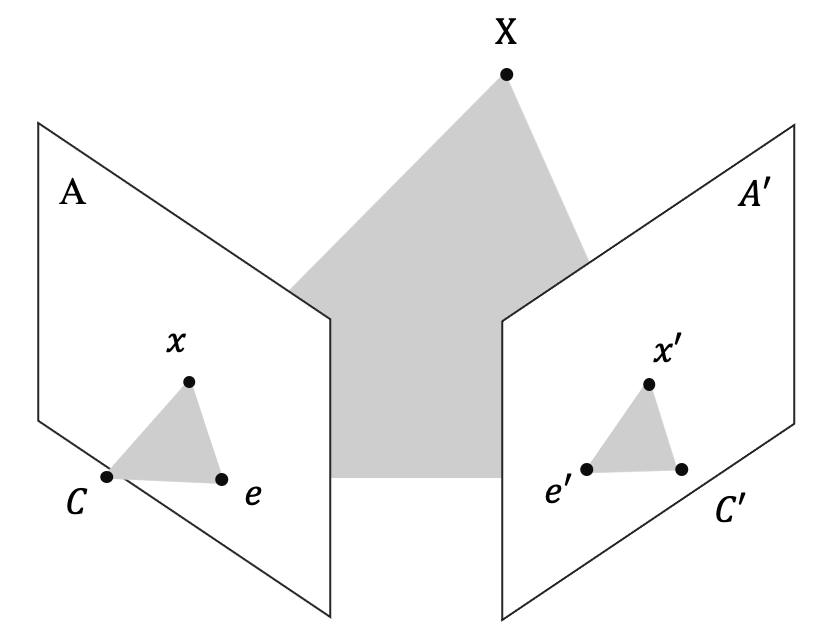

> 图2.1 对极几何示意图

​	需要注意的是，对极几何描述的是两视图间的内在射影关系，只与相机内参和两视图间的相对姿态有关，不依赖外部场景。因此，如果世界中的某研究对象$X$在成像平面$A$上的像点$x$已知，则$X$在另一个构成对极平面的成像平面$A'$上的像点必然在极线$x'e'$上，通过上述极限约束可以大大缩小特征点匹配时的搜索范围。通过对极几何的建模，使得对应点匹配从整幅图像上的寻找压缩到在一条直线上的寻找。

### 2.1.2 单应变换

​	单应变换（Homography）是将空间中的点变换到另一个空间中的投影方式，广泛地用于图像变换中。由单应变换衍生出的单应变换矩阵的一般形式可以表示为
$$
H=\left[\begin{array}{lll}
h_{11} & h_{12} & h_{13} \\
h_{21} & h_{22} & h_{23} \\
h_{31} & h_{32} & h_{33}
\end{array}\right]
$$
​	在图2.1中，假设相机$C$和$C'$间存在旋转$R$和位移$t$，则在对应成像平面上的像点存在关系：$x' = Rx + t$。由此，单应变换矩阵$H$可以通过公式2.2进行表达，其中$d$可理解为相机$C$距观察点的垂直高度，而$n$代表该平面的法向量。
$$
H = K(R + \frac{1}{d}tn^T)K^{-1}
$$
​	在代数中，假设单应变换矩阵$H$将一张图像上的点$a=(x,y,1)$映射到另一张图像上的坐标点$a'=(x',y',1)$，根据单应变换的性质和特点可知$a' = H a^T$，将其展开并进行变换可得公式2.3。
$$
\left[\begin{array}{ccccccccc}-x & -y & -1 & 0 & 0 & 0 & x x' & y x' & x' \\ 0 & 0 & 0 & -x & -y & -1 & x y' & y y' & y'\end{array}\right]h = 0
$$
​	其中将h为9维列向量$h=\left[h_{11}, h_{12}, h_{13}, h_{21}, h_{22}, h_{23}, h_{31}, h_{32}, h_{33}\right]^{T}$，如令
$$
A = \left[\begin{array}{ccccccccc}-x & -y & -1 & 0 & 0 & 0 & x x' & y x' & x' \\ 0 & 0 & 0 & -x & -y & -1 & x y' & y y' & y'\end{array}\right]
$$
​	则公式2.3可简化为
$$
Ah = 0
$$
​	由于单应变换中采用齐次坐标表示平面上的点，所以存在非零标量$s$，使得$b = sHa^T$与$b' = sHa^T$表示同一点$b$，若令$s = \frac{1}{h_{33}}$，则单应变换矩阵的最后一项系数为1，自由度（Degree of Freedom，简称dof）为8。因此只需两幅图像中的4个点对，就可以求解线性方程组的方式解得两图像间的单应变换关系。如果对应点对多于4对，可以通过最小二乘法求解单应变换矩阵，或通过将矩阵$A$进行SVD分解，即$A = U \times \Sigma \times V^T$，取$V$的最后一列作为对应点求解h。

### 2.1.3 平面扫描

​	平面扫描（Planning Sweeping）方法通将对多台相机对场景中物体拍摄得到的经过校准后的图像进行建模，通过单应变换和构建损失函数的方法，求得平面中点在真实物理空间的深度。平面扫描方法基于所有物体只有漫反射的假设，且不考虑场景中的光照变换，构建近平面、远平面和虚拟相机，并将物体用一系列等间距的密集平面进行划分。平面扫描的示意图如图2.2所示。

> 图2.2 平面扫描示意图

​	如果平行平面划分的足够精细，则物体表面的任意一点$p$一定在某一平面$D_i$上，则可以看到该点$p$的相机记录的图像像素值必定相等，而与$p$在同一平面的另一点$p'$并不位于物体表面，则投影到各个相机上的像素值不同。因此平面扫描算法假设：对于平面上的任意点$p$，如果其投影到每个相机上的像素值均相同，则该点很大概率上是物体表面的点。

​	平面扫描算法主要包括两个核心步骤：

（1）将平行平面$Di$上的每个点投影到所有相机上，根据投影得到的像素值进行匹配计算，得分越高，则表示投影在各个相机上的像素越接近，此估计的深度值越精准

（2）将得分高的点再投影到虚拟相机$x$上，并从后到前扫描平面，如果某一平面$D_j$上的点$q$投影到虚拟相机上的得分高于之前的分数，则更新该点的深度和分数，直至平面扫描结束

​	在实际问题中，由于光照和噪声等影响，往往不仅使用像素值，还需要结合窗口信息进行比较，并使用损失函数进行优化，公式如下所示，其中$W$代表以$x,y$为中心的窗口，$\beta$为增益因子。
$$
\begin{aligned}
C\left(x, y, \Pi_{k}\right) &=\sum_{k=0}^{N-1} \sum_{(i, j) \in W} \mid I_{r e f}(x-i, y-j)-\beta_{k}^{r e f} I_{k}\left(x_{k}-i, y_{k}-j\right) \mid
\end{aligned}
$$

​	根据损失函数可以通过公式2.7计算各个点在系列平面的最小值，并使用公式2.8计算该点在物理空间的深度
$$
\tilde{\Pi}(x, y)=\underset{\Pi_{m}}{\operatorname{argmin}} C\left(x, y, \Pi_{m}\right)
$$

$$
Z_{m}(x, y)=\frac{-d_{m}}{\left[\begin{array}{cc}
x & y & 1
\end{array}\right] K_{r e f}^{-T} n_{m}}
$$

### 2.1.4 立体匹配

​	立体匹配（Stereo Matching）也称视差估计或双目深度估计，通过一对在同一时刻捕捉的，并经过极线校正过的左右视图，估计参考图像每个像素对应的深度值，如图2.3所示。

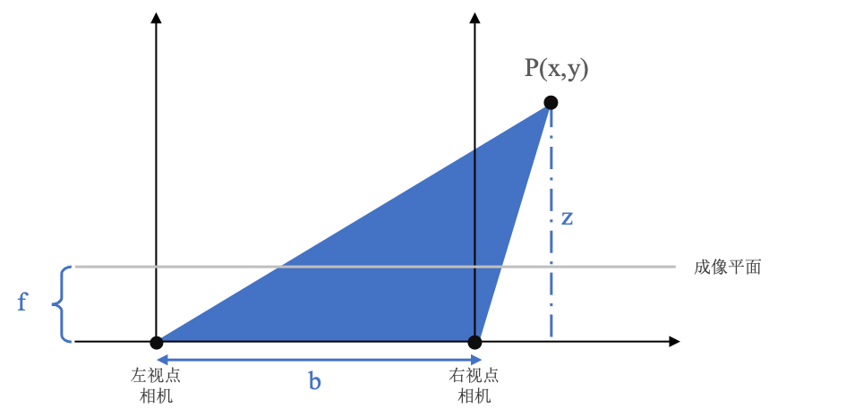

> 图2.3 立体匹配示意图

​	图中$b$代表两相机光心的距离，$f$表示相机光心到成像平面的焦距，$d$为两相机的视差，根据摄影测量和三角形相似等知识可以推导出计算深度的公式如公式2.9所示。
$$
z = \frac{b \times f}{d}
$$
​	而在具体实现时主要分为四个步骤：

（1）匹配代价计算：通过匹配代价函数计算待匹配像素和候选像素间的相关性，其中代价越小说明相关性越大。算法将视差搜索范围限定在$D_{min} \sim D_{max}$之间，对于参考图像中的每个像素，用一个$W \times H \times D$维的三维矩阵，存储视差范围内每个像素的匹配代价。该三维矩阵称为视差空间构象（Disparity Space Image，简称DSI），示意图如图2.4所示。

> 图2.4 DSI示意图

（2）代价聚合：通过匹配代价生成的DSI只考虑了局部信息，仅通过两个像素邻域内一定大小窗口中的像素信息计算代价很容易受噪声和光照等影响，尤其是当图像处于弱纹理或重复纹理区域时，代价值极有可能无法准确反映像素之间的关系。因此需要结合全局信息对DSI进行优化，以得到代价聚合后的矩阵$S$。常用的算法有扫描线法、动态规划法、SMG算法中的路径聚合法等。

> 图2.5 代价聚合效果示意图

（3）视差计算：一般采用赢家通吃算法（Winner-Takes-All，简称WTA）算法，在代价矩阵$S$中选择最小代价值对应的视差作为最佳视差。赢家通吃策略如图2.6所示。

> 图2.6 赢家通吃策略示意图（左）和子像素精度优化示意图（右）

（4）视差优化：通过剔除错误误差、适当平滑、子像素精度优化等方法对上一步得到的视差图进一步优化，改善视差图质量。常用的方法有剔除因遮挡和噪声导致计算错误的左右一致性检查法（Left-Right Check）、平滑视差图的双边滤波法（Bilateral Filter）、鲁棒平面拟合法(Robust Plane Fitting)、局部一致性约束法(Locally Consistent)等等。其中子像素精度优化可以通过一元二次曲线拟合法，将WTA算法中最优视差下的代价以及相邻左右视差的代价拟合成一条一元二次曲线，并取二次曲线的极小值作为精细化的深度估计值，如图2.6右侧所示。

 

## 2.2 深度学习方法基础知识

​	本部分将介绍笔者选用的无监督深度学习方法的理论基础，着重介绍卷积神经网络和无监督深度学习。本部分只针对在算法定义与实现中的重点知识介绍，并不涉及相关内容的详细展开。

### 2.2.1 卷积神经网络

​	卷积神经网络是一种模拟生物大脑结构和功能的具有深层次结构的前馈神经网络，是神经网络中的代表网络之一，也是深度学习领域最知名的算法之一。卷积神经网络通过模仿生物神经网络和视感知机制构建，可以用于进行有监督学习和无监督学习。

​	卷积神经网络有着丰富的网络结构，但核心的主要有三层：卷积层（Convolutional Layer）、池化层（Max Pooling Layer）和全连接层（Fully Connected Layer）。

**A. 卷积层**

​	主要用于对输入数据进行特征提取，通过具有不同偏差量和权重系数的的卷积核（convolution kernal）对数据进行卷积操作，进而提取具有某些属性或规律的特征。常见的卷积核大小为一般为3*3，5*5，7*7等，不同的卷积核尺寸影响提取特征的感受野（receptive field）大小，理论上卷积核越大，感受野越大，提取出的特征越被视为全局特征。除此之外卷积层还有如填充（padding）、步幅（stride）等概念在此不做展开。

**B. 池化层**

​	主要对卷积层提取出的特征进行下采样（down-sampling），不仅降低了数据尺寸加快网络的训练和防止过拟合，同时对特征进行过滤和选择，保留最显著的特征，并且不会对数据信息造成丢失。常用的池化方法有平均池化（mean pooling）、最大池化（max pooling）等。

**C. 全连接层**

​	使用卷积层和池化层提取出的特征进行分类，并通过调整神经网络中参数的权重让网络具有更好的分类效果，即通过得到的高阶特征完成学习任务。

### 2.2.2 无监督深度学习

​	卷积神经网络可以用于实现有监督学习和无监督学习，但随着有监督学习的逐步发展，人们发现优秀的深度学习方法不仅受限于算法本身，很大程度还受限于数据。原始的数据获取方法通过研究人员手动构建特征，并通过众包的方式获取手工标注数据，虽然也有诸如亚马逊土耳其机器人（Amazon Mechanical Turk，简称AMT）[21]等工具帮助获取更大的训练数据集，但相较于大量不易标注或无法标注的数据来说仍然是巨大的损失。无监督学习算法建立在“尽管单一未标注样本蕴含的信息比同样标注过的样本少，但如果获取大量的无标注数据，并能找到方法进行充分利用，算法将获得更好的可扩展性和泛化能力”思想上。

​	接下来笔者将依次介绍两类主要的无监督学习方法：确定型的自编码方法和概率型的受限玻尔兹曼机方法。

**A. 自编码**

​	自编码是一种特殊的三层反向传播（Back Propagation，简称BP）神经网络。不同点在于需要尽可能满足编码无损，即满足自编码网络的输入和输出尽可能的相似。一个典型的自编码网络结构如图2.7所示。

> 图2.7 自编码网络结构示意图

​	无监督学习使用的无真值数据$X$首先经过可见层到隐含层的第一次变换$H = Wx + b$，该变换相当于一个编码过程（encoder），此时输入的数据被进行了一定程度的抽象。得到的抽象数据表示再经过隐含层到输出层的转换$\hat X = W'H + b'$，该变换相当于一个解码过程（decoder）。如果输入数据和输出数据在某种度量上相等或相似，则代表该自编码是无损的，我们可以使用公式2.10表示该自编码结构的损失函数。

$$
C = \frac{1}{2} \times \lVert \hat X - X \rVert ^2
$$

​	但在实际使用自编码结构时，要考虑参数的正则化，此时损失函数如公式2.11所示

$$
C_{normal} = \frac{1}{2} \times \lVert \hat x - x \rVert ^2 + \frac{\alpha}{2} \times (\lVert w \rVert ^2 + \lVert w' \rVert ^2)
$$

​	如上所示，我们就可以据此逐步将输入的无真值数据进行转换，并构建损失函数用于无监督学习的训练过程。但需要注意的是，恒等函数始终满足该“编码-解码“条件，为避免这种情况的发生，一般要求隐含层单元数小于输入输出单元数，例如自编码的输入输出分别为64*64尺寸的图片，则输入单元和输出单元分别为4096个，而隐含层单元可能为100个。

​	随着科学家的发现，生物神经网络中大部分的神经元在同一时刻是处于抑制状态的，只有核心的少量神经元会被激活。根据这个现象的启发，自编码网络一般还要满足稀疏的特征，即当神经元的输出通过激活函数，如Sigmoid函数后，如果接近1，则认为该神经元被激活，反之如果接近0，则认为该神经元被抑制，可用公式2.12作为隐层神经元j在训练中的平均兴奋程度的度量公式。
$$
\tilde{\rho_j} = \frac{1}{m} \times \sum^m_{i=1}(f(h_j) x_i)
$$
​		综上，考虑稀疏性的自编码网络损失函数可以表示为公式2.4，其中“距离”使用相对熵（Kullback-Leibler，简称KL）进行度量。根据损失函数，便可以按照BP算法或其他算法最优化自编码网络中的参数。
$$
C_{final} = \frac{1}{2} \times \lVert \hat x - x \rVert ^2 + \frac{\alpha}{2} \times (\lVert w \rVert ^2 + \lVert w' \rVert ^2) + \sum^m_{j=1}(\rho \times log \frac{\rho}{\tilde{\rho_j}} + (1-\rho) \times log \frac{1 - \rho}{1 - \tilde{\rho_j}})
$$

**B. 受限玻尔兹曼机**

​	另一种无监督学习方法是基于概率的方法，而其中最具代表性的就是受限玻尔兹曼机。受限玻尔兹曼机（Restricted Boltzmann Machines，简称RBM）是一类由两层结构组成，且对称连接无反馈的随机神经网络模型。其简要结构如图2.2所示，层间保持全连接，但层内无连接。

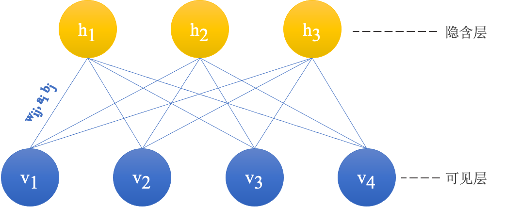

> 图2.8 受限玻尔兹曼机网络结构示意图

​		可见层$V$用于观测和表示数据，隐层$h$用于提取特征，$W$为两层间的连接权重，在受限玻尔兹曼机中可见层和隐层可以为任意的指数族单元，如softmax单元、泊松单元、高斯单元等。假设所有可见单元和隐单元均为二值变量，即$\forall i, j, v_i \in \{0, 1\}, h_j \in \{0,1\}$，对于一组给定的可见层和隐层单元状态$(v,h)$，和一组参数参数$\theta = \{W_{ij}, a_i, b_j \}$，受限玻尔兹曼机系统的能量如公式2.14所示
$$
E(v, h \mid \theta)=-\sum_{i=1}^{n} a_{i} v_{i}-\sum_{j=1}^{m} b_{j} h_{j}-\sum_{i=1}^{n} \sum_{j=1}^{m} v_{i} W_{i j} h_{j}
$$
​		基于系统的能量函数，对于一组给定的可见层和隐层单元状态$(v,h)$的联合概率密度分布表示如公式2.15所示，其中$Z(\theta)$为归一化因子的能量和，即所有可能情况下的能量总和。
$$
P(v, h \mid \theta)=\frac{e^{-E(v, h \mid \theta)}}{Z(\theta)}, \quad Z(\theta)=\sum_{v, h} e^{-E(v, h \mid \theta)}
$$
​		当使用训练好参数权重的受限玻尔兹曼机进行观测时，如数据$v$的分布$P(v \lvert \theta)$，通过对公式2.15求解边缘分布即可，如公式2.16所示
$$
P(v \lvert \theta) = \frac{1}{Z(\theta)}\sum_h e^{-E(v, h \lvert \theta)}
$$
​		但此公式需要计算$Z(\theta)$，需要对所有的可见层单元和隐层单元累加，计算量很大。但由受限玻尔兹曼机的特殊结构可知，当给定可见层单元的状态时，各隐层单元的激活状态间条件独立，此时，第$j$个隐层单元的激活概率为
$$
P(h_j = 1 \lvert v, \theta) = \sigma(b_j + \sum_i v_i W_{ij})
$$
​		其中$\sigma$为sigmod激活函数，具体表示为公式2.18
$$
\sigma(x) = \frac{1}{1 + e^{-x}}
$$
​		根据受限玻尔兹曼机的结构对称性，在给定隐层单元状态时，各可见层单元的激活状态也是条件独立的，此时，第$i$个可见单元的激活概率为

$$
P(v_i = 1 \lvert v, \theta) = \sigma(a_i + \sum_j W_{ij} h_j)
$$
​		而受限玻尔兹曼机神经网络的求解任务$\theta = \{W_{ij}, a_i, b_j \}$只需通过最大化无真值训练集上的对数释然函数即可进行训练，由公式2.20表示
$$
\theta^{*}=\underset{\theta}{\arg \max } \mathcal{L}(\theta)=\underset{\theta}{\arg \max } \sum_{t=1}^{T} \log P\left(v^{(t)} \mid \theta\right)
$$

-----

# 第三章 多视点三维重建

​	本章将详细介绍现阶段多视点深度估计和三维重建中几种优秀的方法，这些方法从相似角度阐述多视点三维重建问题，但依照的原理和实现的方法各有特点。本章将首先介绍北卡罗来纳大学教堂山分校和苏黎世联邦工业大学于2016年提出基于传统计算机视觉的Colmap方法，该方法在公开数据集榜单上一直取得很好的成绩，后人在此基础上又增加了一些计算机视觉和图像处理的方法，使其成为传统方法中的标杆。在第二部分介绍2018年由香港科技大学权龙教授团队打造的基于深度学习解决MVS问题的开山之作MVSNet，该方法问世之后在Tanks and Temples数据集上一举取得了最好成绩，甚至超过很多传统算法，后人在此基础上不断发展，逐步开始了依靠深度学习技术解决MVS问题的大方向。

​	本章还将基于两种经典的方法和其他工作进行多视点三维重建应用无监督深度学习方法的理论基础铺垫，并为第4章的算法实现打下基础。

 

## 3.1 传统计算机视觉Colmap方法

### 3.1.1 概述

​	基于传统计算机视觉的多视点三维重建方法Colmap的流程图如图3.1所示。

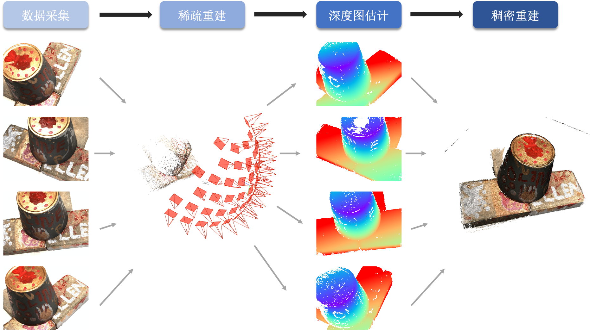

> 图3.1 Colmap算法流程图

​	接下来的两小节将依次介绍Colmap方法的核心流程，包括稀疏重建、深度图估计、稠密重建；以及Colmap方法的创新点和主要贡献，包括场景图改进与增强、后续最优帧的选择、鲁棒的三角化、BA优化。

### 3.1.2 核心流程

**A. 稀疏重建**

​	MVS问题的第一个步骤是要从输入图像中提取特征点并进行匹配，Colmap通过增量式建模恢复场景的稀疏三维结构及相机位姿，其流程图如图3.2所示。

> 图3.2 Colmap稀疏重建流程图

​	特征提取主要使用常用的特征提取算子，如SIFT进行提取。提取后的图像特征点经过多视点的特征点匹配算法进行特征匹配，以生成场景图（Scene Graph）和匹配矩阵（Matching Matrix）。之后采用增量式的SfM算法逐步增加视角迭代地优化重投影误差，确定不同视图和点云间的可视关系，并得到场景中的相机位姿和表示场景结构的稀疏点云。

​	增量式SfM采用迭代的算法逐步优化稀疏重建结果，其算法流程如下

（1）对无序图像进行特征匹配和三角测量以初始化

（2）通过已有点云重新估计相对相机位姿

（3）进行全局和局部的BA优化

（4）增量添加视角，再次进行三角测量和相机位姿估计

（5）再进行BA优化修正结果

**B. 深度图估计**

​	多视点三维重建通过深度估计算法恢复参考图像中的像素深度信息，在Colmap中使用GEM模型进行求解。深度图估计主要包括四个步骤，如图3.3所示。

（1）在原始图像中筛选与参考图像配对一同计算视差的候选集

（2）迭代计算参考图像上每个特征对应的匹配代价

（3）将代价进行聚合以计算深度值

（4）最后通过深度过滤进行深度图优化

> 图3.3 Colmap深度图估计流程

​	Colmap使用NCC作为图像间的光学一致性度量，特征$l$的最优深度$\theta_l^{opt}$和最优化拟合平面的法向量$n_l^{opt}$满足公式3.1。
$$
(\theta_l^{opt}, n_l^{opt}) = argmin_{\theta_l,n_l} \sum_{i=1}^N P_{l}(i)(1 - NCC_l^i)
$$
​	然后利用图像块匹配（Patch Match）[22]信息传递策略进行代价累计，公式3.1被修改为
$$
(\theta_l^{opt}, n_l^{opt}) = argmin_{\theta_l,n_l} \frac{1}{\vert A \vert} \sum_{i \in A} \xi_l^i
$$
​	由于深度开始时被随机初始化，对于纹理缺少的区域或光滑表面等，通过Patch Match方法进行船体可能因无法准确获取深度信息而残留碎挤汁，因此造成初始深度图的不光滑。因此再利用光学一致性和几何一致性约束对初始深度图进行过滤，也即达到对视角进行平滑。在原论文中，作者引入判据$q$，如果满足$q(Z_l^i) > \bar {q_Z}$且$q(\alpha_l^i) > \bar {q_\alpha}, q(\beta_l^i) > \bar {q_\beta}, q(\gamma^i) > \bar {q_\gamma}$，则表征特征$l$在代表$i$上的对应像素$x_l^i$是在多视图间稳定的，即多视图之间是几何稳定的。

C. 稠密重建

​	最后利用深度图配准原理融合深度图，进行稀疏点云的稠密恢复，计算公式如公式3.3所示
$$
z\left[\begin{array}{l}
u \\
v \\
1
\end{array}\right]=P \cdot p^{w}=K(R \mid t) p^{w}
$$

### 3.1.3 创新点与主要贡献

​	本节将对Colmap的上述步骤进行补充，主要围绕Colmap方法的核心特性、创新点和主要贡献展开，也希望借此启发笔者对于无监督多视点三维重建算法的实现。

**A. 场景图改进与增强**

​	Colmap采用多模型几何验证策略用于增强场景图，对于输入的一组图像对，具体操作流程如下：

（1）计算基础矩阵$F$及内点数，若内点数大于$N_F$，则认定图像对通过几何校验

（2）计算单应矩阵$H$及内点数$N_H$，若$\frac{N_H}{N_F} < \varepsilon_{HF}$，则代表相机因发生移动而造成纯旋转假设估计的效果不理想，此时认定该场景为常规场景（General Scene）

（3）计算已标定相机的本质矩阵$E$和内点数$N_E$，若$\frac{N_E}{N_F} > \varepsilon_{EF}$，则代表相机标定参数符合要求，此时可分解本质矩阵$E$得到相机位姿，并对点进行三角化处理，计算三角化点点平均角度$\alpha_m$用以区分纯旋转（Pure Rotation，也称作Panoramic）和平面（Planar Scenes，也称作Planar）特征

​	综上，Colmap根据假设条件，通过统计几何校验的内点数判断模型的类型。

**B. 后续最优帧的选择**

​	参与下一步重建的图像对的选择对相机位姿估计、三角化精度硬系那个是非常大的，因此进一步影响重建效果。通常选取能使得三角化点数量最多的图像，即能观察到最多场景像素的图像作为后续的最优帧，但V. Lepetit[23]等人通过实验验证PnP位姿计算精度不仅与观测到场景中点的数量相关，而且与观测到场景中点在图像中点分布有关，且点分布越均匀，相机位姿计算精度越精确。

​	Colmap采用的方法如图3.4所示，将每张图像划分成$L$层，每层划分为$K_l^2$个格子，每个格子中用空和满表示，当某一个格子中点变为可见时，该格子被标记为满，该图像点评分权重随即增加，最后统计可见点在每层中的得分并累加。可见点在相同数量的情况下，分布越均匀得分越高。

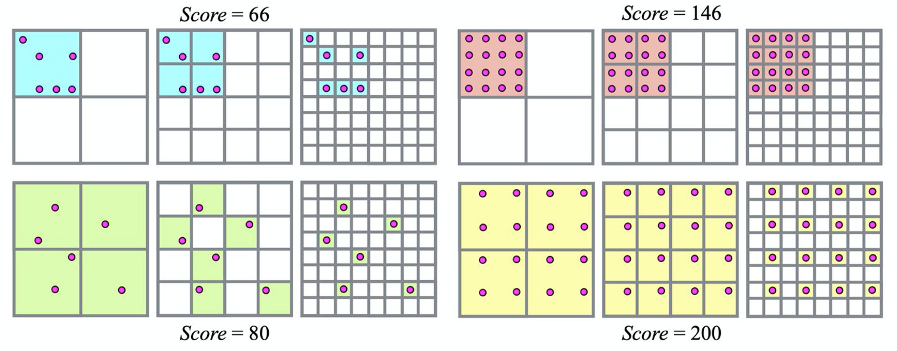

> 图3.4 Colmap后续最优帧选择中不同点的分布与得分关系示意图

**C. 鲁棒的三角化**

​	由于场景中的点不能被持续观测，因而特征追踪可能因此导致错误匹配，进而导致后续的三角化发生错误，因此Colmap使用RANSAC对多帧观测的图像进行三角化。能够进行三角化的点$X_{ab}$计算方法如公式3.x所示，其中$\tau$可采用任意三角化方法，在Colmap中使用DLT三角化法[24]。
$$
\mathbf{X}_{a b} \sim \tau\left(\overline{\mathbf{x}}_{a}, \overline{\mathbf{x}}_{b}, \mathbf{P}_{a}, \mathbf{P}_{b}\right) ,  a \neq b
$$
​	计算得到的三角化点$X_{ab}$还需要满足两个条件才可被判定为鲁棒的三角化点

（1）三角化角度足够大，其计算结果如下
$$
\cos \alpha=\frac{t_{a}-X_{a b}}{\left\|t_{a}-X_{a b}\right\|_{2}} \cdot \frac{t_{b}-X_{a b}}{\left\|t_{b}-X_{a b}\right\|_{2}}
$$
（2）三角化点深度非负，且重投影误差小于设定的阈值$t$

**D. BA优化**

​	Colmap在tx选取及三角化后通过BA优化消除累计误差，且由于增量式重建仅会影响相邻帧，所以不需要每轮迭代都进行全局BA优化。BA优化主要包括四个核心点。

（1）局部BA优化主要是用柯西核函数处理外点，但当视点数量增加，也可以使用PCG求解器处理

（2）BA优化后，相机位姿发生了改变，因此需要再次删除重投影误差较大的观测，并检查几何校验是否仍然保持

（3）由于相机位姿的优化，使得之前无法三角化的点可能在准确位姿估计下进行三角化，因此在BA优化后要进行重三角化（post Re-Triangulation，简称post RT）

（4）上述BA优化和重三角化需要迭代进行不断优化

 

## 3.2 有监督深度学习MVSNet方法

### 3.2.1 概述

​	MVSNet是端到端的有监督深度学习多视点深度图推断方法，MVSNet方法主要包括四个主要流程，其主要流程及网络架构如图3.5所示。

>  图3.5  MVSNet主要流程及网络架构

（1）利用CNN网络提取视觉图像特征

（2）通过可微单应投影变换（differentiable homography warping）和基于方差的成本度量（variance-based metric），依据视点的相机视锥构建3D代价体

（3）使用三维卷积对代价体进行正则化，回归生成原始深度图

（4）通过参考图像对深度图进行优化以提升边界区域的准确性

​		接下来的两小节将依次介绍MVSNet方法的核心流程，包括图像深度特征提取、匹配代价的构建与聚合、深度估计和深度图优化、损失函数构建；以及MVSNet方法的部分实现细节和总结。

### 3.2.2 核心流程

**A. 图像深度特征提取**

​	第一个关键步骤与Colmap等传统方法相似，都需要对$N$张输入图像$\{ I_i\}^N_{i=1}$提取特征，并得到$N$个深度特征图$\{ F_i\}^N_{i=1}$，用于后续的投影和匹配，但是基于深度学习的方法采用八层的2D CNN网络从图像中提取有关深度线索的高级特征。2D CNN网络的每个尺度有两个卷积层，除最后一层外每个卷积层由批归一化层（Batch-Normalization，简称BN）和线性整流函数（Rectified Linear Unit，简称ReLU）组成，第三层和第六层的卷积步长为2，用以得到三个尺度的特征图，且各参数在特征提取网络中全局共享，用于更高效的进行训练和学习。

​	2D CNN的输出时$N$维32通道的特征图，与输入图像相比，每个维度缩小4维。虽然经过特征提取之后图像帧进行了如此的下采样，但这些被剔除掉的像素的原始近邻信息已经被编码到32通道的像素级描述子中，在密集匹配中不会丢失对学习有意义的上下文信息。

​	作者在后续实验中证明，与直接进行简单密集匹配相比，通过提取出的高级深度特征显著地提升了重建的质量。

**B. 匹配代价构建与聚合**

​	第二个步骤将提取出的高级深度特征图与相机参数融合用以构建3D代价体，传统方法时使用标准网格划分空间，但是并没有充分利用相机属性和对极几何背景知识，在MVSNet中，采用基于参考相机视锥体的方式进行代价体的构建，其中相机视锥体示意图如图3.6所示。

> 图3.6 相机视锥体示意图

​	再通过投影操作，即可连接二维特征与三维正则化网络，MVSNet中采用可微单应投影变换进行计算，以实现深度图推理的端到端训练。所有特征图都被影射到参考相机不同的前平行平面，以组成$N$个特征体$\{V_i\}^N_{i=1}$，通过投影变换，将某个深度图以深度$d$从$V_i(d)$影射到$F_i$，记$H_i(d)$为第$i$张特征图与参考特征图在深度$d$的投影，$n_1$为参考相机的主轴，投影矩阵$H_i(d)$计算公式由公式3.7描述。投影过程与经典的平面扫描算法类似[4]，取而代之的是在可微的双线性插值时从特征图$\{F_i\}^N_{i=1}$中采集像素，而不是原始图像$\{I_i\}^N_{i=1}$。
$$
\mathbf{H}_{i}(d)=\mathbf{K}_{i} \cdot \mathbf{R}_{i} \cdot\left(\mathbf{I}-\frac{\left(\mathbf{t}_{1}-\mathbf{t}_{i}\right) \cdot \mathbf{n}_{1}^{T}}{d}\right) \cdot \mathbf{R}_{1}^{T} \cdot \mathbf{K}_{1}^{T}
$$
​	将多重特征体$\{V_i\}^N_{i=1}$聚合为一个代价体$C$，为适应任意数量视点的输入，MVSNet提出了基于方差的代价度量指标$\mathcal{M}$，用以度量$N$个视点的相似性。最终代价体的尺寸为
$$
V = \frac{W}{4} \cdot \frac{H}{4} \cdot D \cdot F
$$
​	其中$W,H,D,F$分别代表输入视点图像的宽度、高度、深度样本数以及特征图通道数。由上，代价度量指标$\mathcal{M}$计算公式为
$$
\mathbf{C}=\mathcal{M}\left(\mathbf{V}_{1}, \cdots, \mathbf{V}_{N}\right)=\frac{\sum_{i=1}^{N}\left(\mathbf{V}_{i}-\overline{\mathbf{V}}_{i}\right)^{2}}{N}
$$
​	传统MVS方法通过启发式的方法计算参考图像和原始图像间的损失，Hartmann, W.[26]等人提出的方法中认为所有视图都应该平等地贡献匹配样本，并且不必优先考虑参考图像，因此直接对多个CNN层取平均值来得到多布丁相似度（Multi-Patch Similarity）。然而在MVSNet中认为均值操作本身没有提供关于特征差异的任何信息，并且需要附加预处理和后处理CNN层协助推断相似性，MVSNet将其进行改进，通过计算方差的操作明确地衡量多视图特征的差异。

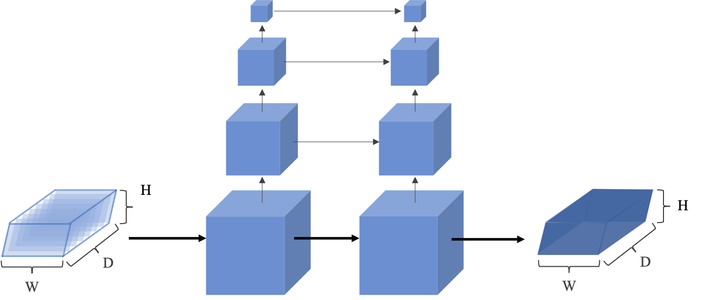

> 图3.7 代价体正则化网络结构

​	在代价体正则化阶段，MVSNet又将代价体$C$进一步转换为概率体$P$，以消除图像特征提取构建代价体阶段可能存在的噪声问题，并结合平滑约束以推断深度图。MVSNet中采用多尺度的3D CNN用于代价体的正则化，参考UNet[27]作为启发，构建3D版本的编码器-解码器结构，以相对低的内存和计算资源从一个较大的感受野中聚集邻域信息，如图3.7所示。概率体不仅可用于像素级的深度估计，还可用于表征深度估计的置信度，最后沿深度方向应用softmax运算进行概率归一化以完成代价体正则化。

**C. 深度估计和深度图优化**

​	从概率体$P$中提取深度图$D$一般采用第2章介绍过的赢家通吃算法，但无法进行亚像素级的估计，且由于其不可微性，无法在神经网络中用于反向传播训练。MVSNet沿梯度方向计算期望值，例如使用公式3.9计算所有假设概率的加权和，该方法与WTA算法如argmax结果相似，，且结果完全可微。
$$
D = \sum_{d = d_{min}}^{d_{max}} d \times P(d)
$$
​	沿深度方向的概率分布也反映出深度估计的质量。尽管3D CNN有一定程度上的正则化能力，但是得到的概率分布仍然是分散的，不能集中到单峰，如图3.8所示。MVSNet定义深度估计的质量$\hat d$作为估计得到的深度值在真值附近的概率，且可以作为后续控制离群点滤波时的阈值参数。

> 图3.8 预测深度图、概率分布和概率图的说明

​	通过概率体恢复得到的深度图可能由于正则化时使用过大的感受野而造成过于平滑。可以采用参考图像自身所携带的边缘信息指导深度图的优化，在MVSNet的末端添加了深度残差学习网络（Depth Residual Learning Network）。原始深度图和统一尺寸后的原始图像聚合后形成四通道输入，然后经过三个32通道的2D卷积层和一个单通道的卷积层学习深度残差。最后结合原始深度图一同生成优化后的深度图。

**D. 损失函数构建**

​	综合原始深度图和优化后的深度图，使用深度图的真值和估计值的平均绝对误差作为训练误差，MVSNet通过公式3.y定义损失函数，由于前文提到在数据集真值的采集中无法做到逐点的完全精准，因此这里只考虑$p \in p_{valid}$即有确定标签的像素计算损失函数。
$$
\text { Loss }=\sum_{p \in \mathbf{p}_{\text {valid }}} \underbrace{\left\|d(p)-\hat{d}_{i}(p)\right\|_{1}}_{\text {Loss } 0}+\lambda \cdot \underbrace{\left\|d(p)-\hat{d}_{r}(p)\right\|_{1}}_{\text {Loss } 1}
$$

### 3.2.3 部分实现细节与总结

​		基于有监督的深度学习MVS方法在大型室内数据集DTU上进行训练和测试，在完整性和准确度上都超过之前最好的方法，由于深度学习算法的特点，在运算速度上比传统方法加速几倍甚至几个数量级。不仅如此，MVSNet还在复杂的室外数据集Tanks and Temples上进行测试，在榜单上位列第一且没使用任何微调手段，足见其泛化能力。

​		视角选择方面MVSNet在训练时设定$N=3$，即选定一张参考图像和两张原始图像作为输入，但在测试时可以自由的设定任意数量的视角数$N$。MVSNet在实现时可以选择是否在最后进行深度图过滤后处理，并设定了光度一致性与几何一致性两种程度的验证方式，这也对后续无监督深度学习方法提供了很多借鉴意义。光度一致性滤波表征匹配质量；几何一致性表征多视角中的深度一致性，将参考图像像素点$p_1$处的深度值$d_1$投影到邻域图像中的$p_i$处，然后再将$p_i$在其深度值$d_i$处重投影至参考图像$p_{reproj}$处，此时的深度估计为$d_{reproj}$，如果满足$\vert p_{reproj} - p_1 \vert < 1$且$\frac{\vert d_{reproj} - d_1 \vert}{d_1} < 0.01$，则两视点满足几何一致性。通过上述两步滤波可以充分滤除多种类型的离群值，为算法带来很大程度上的鲁棒性提升。

​		综上，MVSNet作为基于深度学习的多视点深度估计和三维重建的开山之作，充分总结完善前人积淀，编码相机参数作为可微单应投影，并结合图像信息构建代价体，同时嫁接了2D图像特征与3D损失回归的深度学习神经网络。为后续工作充分利用深度学习技术改进MVS问题的求解打下了良好的基础。笔者也将使用MVSNet作为模板，将其融入无监督深度学习的特性进一步完善。

-----

# 第四章 无监督深度学习算法实现

------

​	本章将在第3章基础上总结Colmap方法和有监督学习多视点三维重建方法的核心思想，以及前人在基于无监督学习的单视点、双视点及多视点三维重建的尝试，进一步完善基于无监督深度学习的多视点三维重建方法。

​	本章将首先介绍无监督学习方法的概述，并围绕鲁棒的光度一致性、无监督损失函数及深度学习网络架构展开，最后将就算法实现中的细节展开介绍。

 

## 4.1 算法概述

​	无论是有监督学习还是无监督学习MVS，当前的方法主要利用的是潜在的几何一致性与光度一致性，即保证在深度方向将图像中的每个像素投影到参考图像中，判断是否能正确匹配。这些约束能够独立分析各个场景的信息但不能很好的归纳使用整个空间的一般先验知识，尤其是在场景中特征比较稀疏或表面材质缺失情况尤为严重。而对于土木工程场景，大量的地面、墙面及其他施工场景极难提取特征，如图4.1所示。

> 图4.1 特征稀疏的土木工程场景示意图

​	为克服上述问题，尤其是针对土木工程场景传统计算机视觉特征缺失的问题，基于深度学习的方法，尤其是训练CNN网络跨视图提取和合并深层次深度信息的方法，如3.2节介绍的MVSNet方法，极大程度的改善了这个问题并提出了有效的多视点深度估计和三维重建的深度学习方法。但如1.3.1节提到的土木工程场景面临的问题，这些方法强烈依赖场景的真值，对于土木工程场景这类监督目标过于繁重的任务很难奏效。

​	无监督学习方法MVS克服有监督学习方法MVS强烈依赖场景3D真值作为训练数据的核心障碍，利用多个不同的视角间的光度一致性作为监督信号进行训练，通过正确地处理光度一致像素的重投影问题，最小化重投影误差以训练CNN网络。但如果只简单使用图像间的光度一致性作为衡量，很可能受到如2.1.3节指出问题的影响，这其中最主要的是遮挡（occlusion）和不同视角间光度变换的影响。

​	因此笔者主要做出两部分尝试

（1）光度损失梯度一致性：实验中发现，仅保证像素维度上的一致性很可能受到光照、噪声等影响，但如果在梯度维度上也保证光度一致性则可以大幅度的增强约束力

（2）鲁棒的光度损失：实验中发现，对于某一张参考图像中的像素很有可能在一些原始图像中处于被遮挡的位置而光度不可感知，换言之，某一个特定的像素点不需要在所有其他视图中都保持光度一致，只需在没被遮挡的地方计算重投影误差；通过鲁棒的光度一致性选择性地加强与某些视图的光度一致性即可隐式地处理遮挡问题造成的影响

​	因此，无监督学习多视点三维重建方法仍然以一张参考图像和几张原始图像组成的一组图像，以及预先通过SfM算法求解出的相机内参与外参作为输入，与有监督学习MVS不同之处在于不需要3D场景的真值。利用梯度一致性光度一致和鲁棒的光度损失作为误差训练CNN网络。对于每一张参考图像估计像素级的深度图并进行优化调整，再通过后处理将深度图融合成点云。

 

## 4.2 光度一致性

### 4.2.1 传统的光度一致性

​	光度一致性在单目和双目深度估计中被证明发挥出强有力的作用\[28][29]。其思想可简要概括为通过预测深度图建立原始图像和参考图像的对应关系，并通过单应变换实现正向和逆向的投影，如果投影前后的像素距离在合适的范围内，则认为这组图像在该像素位满足光度一致性要求。

​	在传统的光度一致性度量中，设原始图像为$I_s$，附加的$M$个新视点输入图像记为$\{I_v^m\}$，这些图像被用来作为原始图像$I_s$的参考，用于预测深度图$D_s$。当给定相机参数$(K,T)$后，对于一个视点对$(I_s, I_v^m)$，可以通过预测得到的深度图$D_s$实现逆投影（inverse-warp），即可以将$M$个新视点的图像中的像素投影到原始图像$I_s$中。这里使用M. Jaderberg等人提出的空间转换网络（Spatial Transformer Network）[30]进行处理，通过可微的双线性插值将新视点$I_v^m$进行投影得到$\hat{I_s^i}$。对于原图$I_s$中的某个像素$u$，可以通过单应投影变换得到在投影图像中的新坐标，如公式4.1所示
$$
\hat{u} = K T (D_s(u) \cdot K^{-1} u)
$$
​	通过对投影坐标周围的新视点图像进行双线性插值，得到投影后的图像
$$
\hat I_s^m(u) = I_v^m(\hat u)
$$
​	同时生成了一个二元验证的图像掩膜（mask），由于新视点视图中有些像素在投影后会位于边界之外，所以通过mask可以表征投影后视图中有效的像素。通过设定投影图像和原图像的匹配关系，可以指定光度一致性目标的损失函数为
$$
L_{p h o t o}=\sum_{m}^{M}\left\|\left(I_{s}-\hat{I}_{s}^{m}\right) \odot V_{s}^{m}\right\|
$$

### 4.2.2 鲁棒的光度一致性

​	传统的光度一致性在单目或双目的实践中起到比较好的指导效果，例如在KITTI数据集[4]上进行训练得到理想的效果。但MVS与单目或双目重建存在很大的不同，单目或双目重建的数据普遍只有很少的遮挡或光照变化，甚至对于单目重建问题来说，这些问题根本不存在。但对于MVS数据集而言，由于视点的增多在时间上有连续性，因此自遮挡、光照变换、反射、阴影等对结果的影响非常之大。

​	笔者采用两种策略改进光度一致性约束。

**A. 基于图像梯度构建光度一致性**

​	相较于图像像素本身的光度一致性，图像像素梯度的差异有更强的约束力，因此采用图像像素和图像梯度差异融合的匹配成本进行光度一致性的衡量。公式4.4被做如下修改
$$
L_{\text {photo }}=\sum_{m=1}^{M}\left\|\left(I_{s}-\hat{I}_{s}\right) \odot V_{s}^{m}\right\|+\alpha \left\|\left(\nabla I_{s}-\nabla \hat{I}_{s}^{m}\right) \odot V_{s}^{m}\right\|
$$
​	在实现中取$\alpha = 1$。

**B. 考虑遮挡关系**

​	MVS中的遮挡问题是单目或双目深度估计与三维重建中不存在的，如图4.2所示。对于目标像素$T$，只有在参考视点、新视点3和新视点4中可见，而对于视点1和视点2的同样深度尺度得到的像素分别为$T'_1$和$T'_2$。因此如果使用所有视点进行上述光度一致性检验在很大程度上有失偏颇，但如果使用诸如聚类的方法将上述五个视点进行二分聚类确实可以更加精确的选取不存在遮挡的视点，很可能随着视点增多而变得臃肿，进而影响MVS算法的整体性能与复杂度。

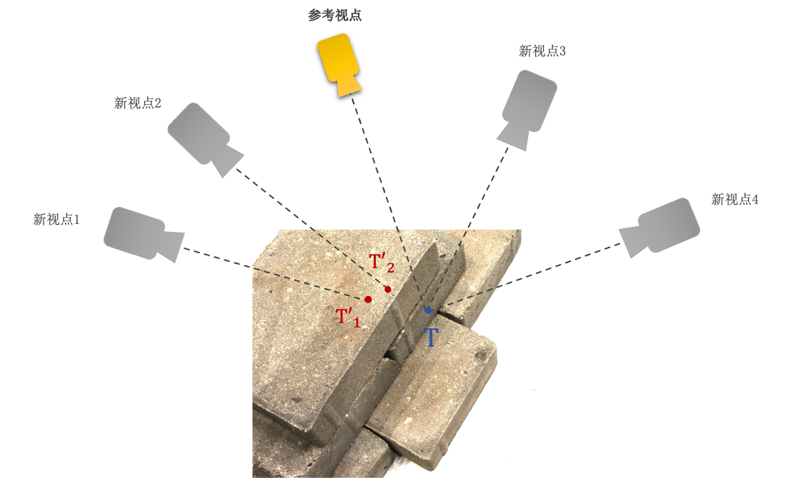

> 图4.2 MVS中的遮挡问题示意图

​	笔者参考其他成熟算法，通过设定$top-K$简单直观的处理遮挡问题。对于新视点$I_m^i$中的某个像素$u$，令它的梯度光学一致性为$L^m(u)$。对于每个像素$u$，在像素投影的有效视图中，只取前$K$个光度一致性最好的不相交视图用以计算损失。鲁棒的光度一致性可由公式4.5表示。
$$
L_{\text {photo }}=\sum_{u} \min _{m_{1}, \cdots, m_{K} \\ m_{i} \neq m_{j} \\ V_{s}^{m_{k}}(u)>0} \sum_{m_{k}} L^{m_{k}}(u)
$$

 

## 4.3 无监督损失函数

​	依照4.2节描述的鲁棒的光学一致性损失函数进行实验，发现存在场景部分重建缺失以及边缘不够平滑等问题。参考R. Mahjourian等人在2018年提出的3D几何约束[29]中提到的图像块级别的结构化相似性损失（Structural Similarity，简称SSIM）和深度图梯度感知平滑损失（简称Smooth），对损失函数进一步优化。

​	两个图像块间的SSIM可由公式4.6表示，其中$\mu$代表局部平均值，$\sigma$代表方差。越高的SSIM值代表二者在结构相似度越高，可通过此更加完整的进行场景中缺失部分的重建。
$$
S S I M(x, y)=\frac{\left(2 \mu_{x} \mu_{y}+c_{1}\right)\left(2 \sigma_{x y}+c_{2}\right)}{\left(\mu_{x}^{2}+\mu_{y}^{2}+c_{1}\right)\left(\sigma_{x}+\sigma_{y}+c_{2}\right)}
$$
​	SSIM对应的损失函数可以描述为公式4.7，其中$M_s^{ij}$代表一个图像掩膜，用于剔除掉投影后在原始图像边界外的像素，以改善边界附近的深度预测。且处于性能的考虑，在具体实现中只考虑参考图像和$top-K$选择中鲁棒光度一致性最高的两个图像进行SSIM损失的求解。
$$
L_{S S I M}=\sum_{i j}\left[1-S S I M\left(I_{s}^{i j}, I_{s}^{\hat{i} j}\right)\right] M_{s}^{i j}
$$
​	平滑损失使得在训练时加强平滑因子的激励信号，尤其是对于图像边缘的平滑，其计算公式如下。
$$
L_{\text {Smooth }}=\sum_{i j}\left\|\nabla_{x} D^{i j}\right\| e^{-\left\|\nabla_{x} I^{i j}\right\|}+\left\|\nabla_{y} D^{i j}\right\| e^{-\left\|\nabla_{y} I^{i j}\right\|}
$$
​	综上我们构建了鲁棒的光学一致性度量，并参考成熟3D几何约束增加了结构相似度SSIM和深度平滑损失，最终的损失函数为上述三者的加权平均。
$$
L = \sum \alpha L_{photo} + \beta L_{SSIM} + \gamma L_{Smooth}
$$

## 4.4 深度学习网络架构

​	主体网络架构参考第3章图3.5所示的MVSNet网络架构，核心要处理的是在没有场景深度真值的情况下进行损失函数的表达。

​	输入的原始图像首先经过特征提取2D CNN网络提取深度图像特征，CNN网络共由8层组成，每一次卷积操作之后都首先通过BN层和ReLU层，直至倒数第二层，最后一层则对每张输入的原属图像进行缩减4个维度的下采样，得到32通道的特征图，同样的，网络权值在所有图像中共享。

​	得到特征图后，即可用公式3.6所示的可微单应投影变换，将特征图按照128个深度值投影到参考相机不同的正平行平面中，且对于每一个原始图像生成一个代价体。接下来使用基于方差的成本度量将所有代价体聚集成一个代价体。同样的，相较于不可微的赢家通吃策略argmax操作，使用三层的3D UNet细化代价体及平滑深度值变换，将原始估计的深度图沿深度通道进行argmin操作，以达到亚像素精度的代价体聚集。通过此操作金光构建代价体的深度值是离散的，但得到的深度图遵循连续分布，且由于其可微性，更利于后续训练。

​	由于在无监督学习策略上采用鲁棒的光度一致性作为损失计算方法，并通过$top-K$策略处理遮挡问题的影响，因此通过得到的原始深度图将聚合的代价体做无监督学习策略的调整，如图4.3所示。参考图像和$M$张新视点图像通过预估计的深度图按照公式4.4所示进行投影变换得到$M$张误差图，并进行聚合得到$H \times W \times M$维的代价体。再通过$top-K$策略从$M$张深度图中选取$K$个误差最小的图像取均值以计算最终鲁棒的光度损失。

> 图4.3 无监督学习中鲁棒的光度一致性与$top-K$策略的架构

​	输出的代价体中深度分布可能由于离群值而造成非单峰情况，通过建立深度估计质量$\hat d$进行剔除和选择，将四个最邻近深度估计的值进行概率累加，然后通过阈值滤波得到优化后的深度图并作为输出代价体的图像掩膜。

​	最后通过参考图像自身所携带的边缘信息进行深度图过于平滑的处理，将预测的深度图和原始图像一同通过四层的CNN网络，得到深度残差图，再将其与初始估计的深度图加权融合即可得到最终的深度图。

-----

# 第五章 实验结果与评估

------

​		本章将主要介绍笔者进行的相关无监督多视点三维重建实验，包括实验环境、实验数据集等配置信息，在不同数据集上的重建效果，消融实验，以及对于实验的评估等内容，一些实现细节已在第4章之处，这里不在赘述。

 

## 5.1 实验环境与数据集简介

### 5.1.1 实验环境

​	本实验所使用的开发环境和主要依赖包参数分别如表5.1和表5.2所示。

​	需要说明的是由于本文进行多种方法的对比实验，因此通过Docker将不同方法打包成不同的镜像以互不影响，依赖包参数说明的仅为无监督学习方法的依赖环境。

> 表5.1 开发环境

|      类型      |    名称     |     版本 / 型号     |              说明              |
| :------------: | :---------: | :-----------------: | :----------------------------: |
|     服务器     |   Ubuntu    |     16.04.6 LTS     |         amd64体系架构          |
|      显卡      |   NVIDIA    | GeForce RTX 2080 Ti |     cuda V10.0，cudnn V7.0     |
|    开发语言    |   Python    |       V2.7.12       |  充分适配Tensorflow-GPU的版本  |
|  深度学习框架  | Tensorflow  |       V1.13.1       |       版本由显卡内核决定       |
| 三维可视化平台 | MeshLab[32] |      V2020.12       |    开源的点云模型可视化软件    |
|      IDE       |   VSCode    |       V1.56.1       |       Python集成开发环境       |
|    容器技术    |   Docker    |      V20.10.5       | 将不同方法环境打包成独立的镜像 |
|      SFTP      |  CyberDuck  |       V7.9.0        |     SFTP远程连接服务器软件     |
|    版本控制    |     Git     |       V2.24.3       |    开源的分布式版本控制工具    |

>  表5.2 主要依赖包参数

|      名称      |   版本   |                说明                |
| :------------: | :------: | :--------------------------------: |
| tensorflow-gpu | V1.13.1  |    Tensorflow在GPU下的依赖环境     |
|     numpy      |  V1.13   |       Python科学计算依赖环境       |
| opencv-python  | V3.2.0.8 | Python使用计算机视觉算法的依赖环境 |
|  scikit-learn  |  V0.18   |          Python机器学习库          |
|     scipy      |  V0.18   |          Python机器学习库          |
|   matplotlib   |   V1.5   |   Python绘图及数据可视化依赖环境   |
|     Pillow     |  V3.1.2  |          Python图像处理库          |
|  nvidia-ml-py  | V375.53  |       NVIDIA GPU管理依赖环境       |

### 5.1.2 实验数据集

​	本实验参照MVS相关问题的最佳实践，采用DTU数据集进行训练和测试，并在Tanks and Temples数据集上进行泛化能力测试，最后通过自采数据集验证该方法在真实实践中的可使用性。接下来笔者将分别介绍这三类数据集。

**A. DTU数据集**

​	DTU数据集\[33]\[34]是针对MVS问题而专门拍摄并处理的室内物体数据集，利用一个搭载可调节照明的ABB工业机械臂对物体进行多视点拍摄，如图5.1所示。所有物体拍摄的视角都经过严格控制，因此可以精准的获得每个视角下相机的内参和外参的精准值。

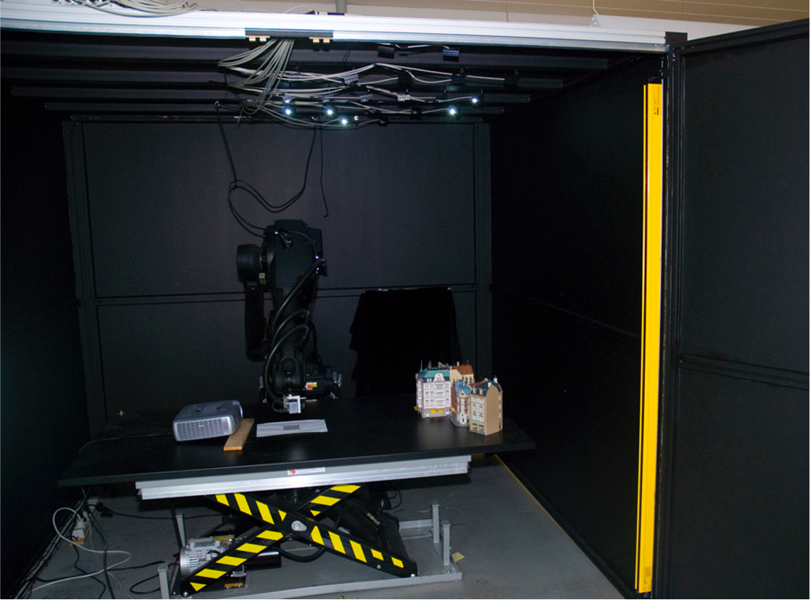

> 图5.1 拍摄DTU数据集所使用的ABB机械臂和拍摄环境

​	数据集中共由124个不同的物体或场景组成，如图5.2上图所示。每个物体共拍摄49个不同的视角，每个视角共有7种不同的亮度，如图5.2下图所示。每个物体或场景数据集中共有343张图片，每张图像分辨率为$1600 \times 1200$。

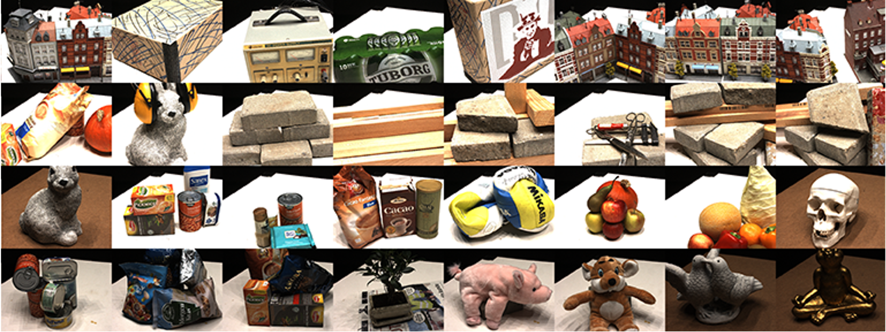

> 图5.2 DTU数据集中部分物体或场景（上）和DTU数据集scan34场景中的部分视角（下）

**B. Tanks and Temples数据集**

​	Tanks and Temples数据集是Arno Knapitsch等人[3]提出的基准测试中所采集的大型室外场景数据集，数据的真值使用工业激光扫描仪获得，同时支持使用视频作为输入以提高重建保真度。但该数据集一般不作为训练使用，而是用于验证方法对光照变化大、存在动态目标的真实场景的泛化能力。其部分场景和视点图像如图5.3所示。

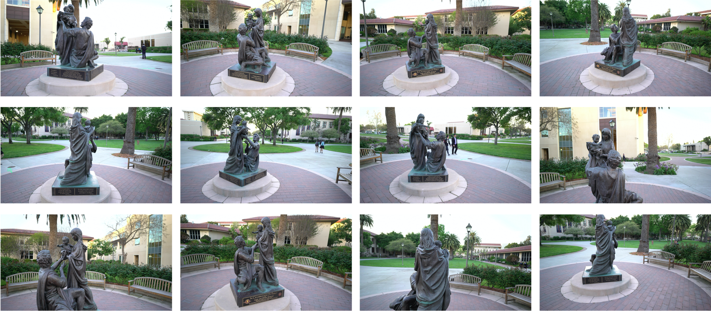

> 图5.3 Tanks and Temples数据集Family场景中的部分视角

**C. 自采数据集**

​	实验中还使用自采数据集进行真实实践的可用性测试，在进行自采图像收集时应注意以下四点：

（1）使用单反或专业数码相机进行数据采集，如果使用手机采集图像，要使用单摄像头手机或对其他摄像头进行遮挡后再进行采集

（2）选择纹理丰富的环境进行图像采集，尽量避免玻璃、瓷砖等强反光场景的影响

（3）选择光照充足且光照条件变换不剧烈的环境，最好选择室内环境且打开室内大灯进行灯光补偿

（4）围绕待重建物体或场景采集较多的图像，在采集过程中控制快门速度，避免模糊，如果使用视频进行抽帧操作得到图像序列，同样需要避免抽帧图像模糊

 

## 5.2 实验结果

​	参考3D几何约束的方法，笔者针对公式4.9采用的权重为$\alpha=12$，$\beta = 6$，$\gamma = 0.18$进行最终重建效果的展示，在GPU上共训练200000轮。

​	本节将依次展示笔者的无监督多视点三维重建方法在DTU数据集和Tanks and Temples数据集上的重建效果，重建后得到ply格式的点云文件，再通过Meshlab软件进行可视化。

### 5.2.1 DTU数据集上重建的效果

​	在DTU数据集的测试集中选取场景9、15、23、24、34、77、114、118进行测试，这些测试都与真实土木工程场景较为相似，通过特殊测试数据的选择可以更加直观反映本方法对土木工程真实场景的三维重建能力。

> 图5.4 DTU数据集中建筑模型的重建效果

> 图5.5 DTU数据集中部分其他模型的重建效果

​	图5.4中全部为建筑楼房的模型场景，该类场景在重建中由于遮挡等问题一直是难度极大的挑战，在无监督学习方法没有真值作为训练依照的情况下，通过鲁棒的光度一致性仍可以进行较大程度的复原与重建，足可见该方法的可靠性。但重建的边缘部分仍然存在很多漏洞与离群点，这是由于在稠密重建之后并没有进行任何额外的滤波和微调，如果再使用例如点云库（Point Cloud Library，简称PCL）中经典的点云聚类和滤波算法可以得到更加精致完整的点云模型。需要注意的是，在土木工程建筑这类大型场景，多视图的实际获取往往是以相机为中心，通过视角的转换和覆盖即可以做到场景的图像覆盖，这类多视图采集方法在真实使用中更为方便，也有更广阔的应用前景。

​	图5.5中主要为土木工程领域中单物体的模型场景，这类场景在多视点采集时往往以场景中物体为中心，通过移动和旋转相机进行多视图的采集。从重建效果来看整体漏洞和离群值较少，已经具有相当的完整性和可使用性。在一些点云处理软件中可以进一步框选所感兴趣深度或范围的点云群并提取再渲染，因此可以进一步做到精细化。

### 5.2.2 Tanks and Temples数据集上重建的泛化效果

​	在Tanks and Temples数据集的测试集中选取场景Family、Train、Hourse进行测试，这些测试集能更好的反映土木工程领域在室外真实作业时的大规模场景变化和光照变化等。

> 图5.6 Tanks and Temples数据集中部分场景的重建效果

​	Tanks and Temples数据集中的场景的视点数量较多，普遍为200以上，且采集时并没有可控的光照和遮挡处理，并且背景也会对待重建主体造成很大程度上的影响。同样基于无监督学习的单目或双目方法对该数据集中场景几乎无法进行有效的重建，而基于鲁棒光度一致性的无监督学习多视点方法可以进行一定精度和完整性的重建，这已经是很大程度上的突破。但是从重建效果中也可以看到相较于DTU数据集中精细化拍摄的多视点图片，在光照剧烈变换且遮挡不可控的场景中，重建效果还有很大的提升空间。需要注意的是，笔者所用的方法在训练时完全未使用该数据集作为训练样本，但仍能该数据集上取得一定的泛化效果。

 

## 5.3 消融实验

​		本节将就4.2节提出的鲁棒的光度一致性和4.3节提出的无监督损失函数进行消融实验，以验证无监督学习多视点三维重建方法中自监督损失函数的作用。本节将依次对结构化相似性损失SSIM、平滑损失Smooth和遮挡策略中提出的$top-K$进行消融处理，并结合无监督深度神经网络在DTU数据集上各自训练40000轮。之后对DTU测试集中的部分场景进行三维重建并比较结果，以分析各部分的影响。

### 5.3.1 误差项的影响

**A. 结构化相似性损失SSIM**

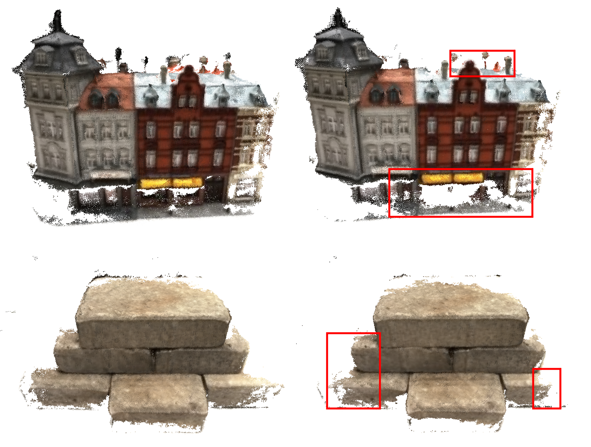

> 图5.7 鲁棒的光度一致性（左）和消融SSIM误差（右）的重建结果对比

​		根据公式4.6和4.7，结构化相似性损失SSIM可根据结构性的相似之处进行完整性方面的更强约束，使得可以跟随相似特征做到更加完整的重建。从图5.7中也可以看到，在场景一的路面、房檐橙色的新建筑；场景二的方砖边缘等都存在大量相似的结构。而消融掉SSIM损失后难以根据结构上的关系进行这些部分的重建，造成完整性的下降。

​		同时从图中我们可以看到SSIM从场景的边缘进行初始化，即场景的部分稀疏边缘被首先确定下来，然后根据相似性判据向内迭代扩展。

**B. 平滑损失Smooth**

>  图5.8 鲁棒的光度一致性（左）和消融Smooth误差（右）的重建结果对比

​		根据公式4.8及图像处理中的平滑知识可知，平滑损失Smooth主要进行点云平滑滤波，尤其是边缘的平滑处理。从图5.7中也可以直观观察到，消融Smooth误差后，场景一雕塑的边缘存在很多噪声，且有较多离群点分散于主体中间；场景二由于曝光度过高，杯盖存在严重杂乱的噪声，且杯壁由于没有进行逐次的平滑累计处理而重建不完全。

### 5.3.2 遮挡视点剔除的影响

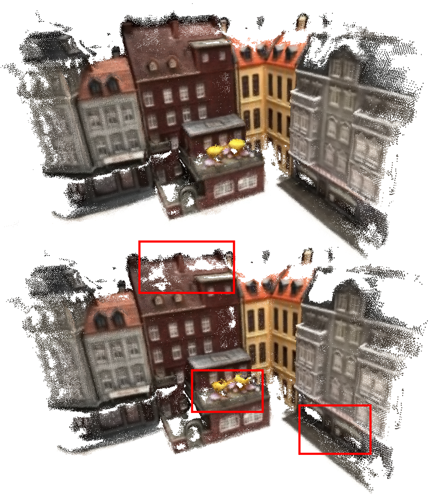

>  图5.9 top-K策略为3（上）和top-K策略为6（下）的重建结果对比

>  图5.10 场景中遮挡关系示意图

​		4.2.2节中通过$top-K$策略改善传统光度一致性约束中要求场景中的每个像素都要在参考图像和所有原始图像中满足基于单应投影变换的光度一致性。根据公式4.5，只需要满足像素在非遮挡图像中的光度一致性就可以更加准确也更加鲁棒的实现匹配。但由于根据聚类或其他方法的思想动态调整$K$值会较大程度地影响算法整体性能与复杂度，因此在具体实现中通过比较不同$top-K$值的结果进行调参。

​		当$top-K$分别为3和6时重建结果如图5.9所示。由于在实现中取每个参考图像对应的新视点原始图像为6，则当$top-K=6$时意味需要满足图像的光学一致性需要在所有原始图像中得到满足。可以看到如果需要满足所有视点的光学一致性会造成比较严重的空洞现象，这是由于不同视点在上述区域的可见性差别很大，在有些视点中这些区域很可能处于不可见位置，如图5.10所示。在左图中场景右侧的黑色房子下方不可见，在右图中场景中间红色房子房顶和黄色遮阳伞部分不可见，如果在这些视图中也强行进行光度一致性配准，则会造成错误的深度值估计和重建效果等。

 

## 5.4 实验评估

​	本节将对无监督学习多视点三维重建的实验效果进行评估，主要参考多视点三维重建问题的经典评估手段，并与第3章着重分析的传统计算机视觉Colmap方法和有监督学习多视点三维重建方法进行对比。

​	需要说明的是，笔者采用的无监督学习方法在相同或相似的条件下无法与基于计算机视觉的传统方法或有监督学习方法媲美，因在训练过程中无监督学习方法依照的损失函数是通过数学公式和经验推导的，而有监督学习方法依照的损失函数直接为预先给定的场景三维信息真值；无监督学习方法是通过自拟合数据集中的训练数据并进行一定程度的泛化，而传统方法是依照严格的数学推导的。但无监督学习方法的意义更为深远，尤其是在土木工程场景的背景下，随着数据规模的增大和待重建场景的复杂化，传统方法的低性能和有监督学习方法真值数据的难获得都将成为三维重建问题极大的障碍，而无监督学习方法可以充分利用大量获取的无真值的数据进行特定场景的训练，在性能和可用性上极具优势。

### 5.4.1 定性评估

​	定型评估中，笔者将所采用的无监督多视点三维重建方法与传统Colmap方法和有监督学习MVSNet重建结果进行横向比较，结果如图5.9所示，从左到右依次为Colmap方法、MVSNet方法和无监督学习方法。

> 图5.11 无监督方法（右）与Colmap（左）和MVSNet（中）方法的重建结果比较

**A. 与传统Colmap方法对比**

​	从感官上，Colmap方法重建结果是最完整且精度最高的，这与Colmap的原理有极大的关系，作为基于传统计算机视觉的方法，充分在对极几何上施加严格的数学约束以进行平面扫描和立体匹配。在基于深度学习方法难以重建的稀疏表面或大幅度遮挡位置，如场景二中两楼遮挡区域，仍能进行较为完整的三维点云重建。但Colmap方法在处理场景和物体边缘时由于视觉特征无法进行有效渐进式的传播，即边缘区域往往是稀疏重建时的边界值，因此在图中所示结果的边缘区域相较于深度学习方法存在一定差距，如场景三中最上方砖块的边缘位置存在着较为强烈的噪声。

​	在具体操作Colmap进行实验时，传统方法的时间消耗是不容忽视的，在一般多视点场景的三维重建尤其是稠密筹建步骤，所花费的时间是深度学习方法的1000倍～10000倍，尤其是场景一、二所示的大型场景耗时将更长，这对于土木工程普遍存在的大规模场景是极难接受的。

**B. 与有监督深度学习MVSNet方法对比**

​	与其他深度学习问题相同，有监督学习方法依靠对场景真值进行拟合，在相仿场景下进行测试的结果确实较无监督学习方法结果出色一筹。尤其是图中场景一下排的路面和树木、场景五中佛像下方被严重遮挡的桌面，在有真值的监督下MVSNet可以进行更精准的复原。

​	但如第1章和第3章提到的，有监督学习方法在泛化性上与无监督方法存在很大的差距，如图5.10所示。在此场景的多视点采集时，待重建物体与背景墙距离很近，纸袋几乎处于同一水平面且特征单一，加之场景前后光照变换较大。有监督学习方法在训练集中没有相似场景的监督下很难进行重建，其效果如图中第二排第一幅点云效果所示，除右侧光照变化不大的墙面以外，对场景重建效果很不理想。而无监督学习方法受鲁棒的光度一致性约束，在此自拍摄场景中表现极为优秀，足见其强大的泛化性。

​	除此之外，无监督学习方法也有更高的可扩展性。由于土木工程场景极难获取真值，有监督学习方法较难进行扩展。

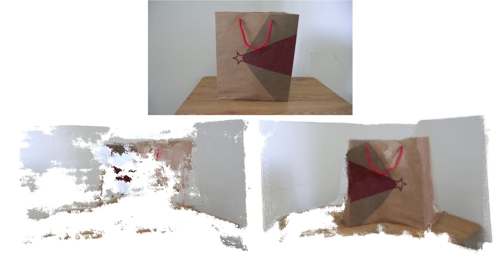

> 图5.12 真实场景中有监督学习方法（左）和无监督学习方法（右）对比

### 5.4.2 定量评估

​	定量评估策略主要参考MVSNet中提到两个大方向，分别是距离度量（mm）和百分比度量（<1mm），共计四种度量指标：

（1）准确性（accuracy，简称Acc.）：衡量预测的深度值与真值间平均误差的度量指标

（2）完整性（completeness，简称Comp.）：衡量重建点云完整度的度量指标

（3）总体性（overall）：准确性与完整性的平均值

（4）f值（f-score）：综合准确性和完整性的度量指标

​	将笔者所训练的无监督学习方法对DTU数据集中的测试集进行三维重建，将生成的22个点云文件通过DTU数据集官方提供的MATLAB脚本进行定量评估。同时参考其他方法对于同样测试集的定量结果，汇总得到表5.3和表5.4。

>  表5.3 不同三维重建方法在DTU测试集上的距离度量（*mm*）定量评估结果

| 方法名称           | Acc.  | Comp. | overall |
| ------------------ | ----- | ----- | ------- |
| SurfaceNet         | 0.450 | 1.043 | 0.746   |
| MVSNet             | 0.444 | 0.741 | 0.592   |
| 经典光度一致性方法 | 1.565 | 1.378 | 1.472   |
| 无监督学习方法     | 1.255 | 1.491 | 1.373   |

>  表5.4 不同三维重建方法在DTU测试集上的百分比度量（<1*mm*）定量评估结果

| 方法名称           | Acc.  | Comp. | f-score |
| ------------------ | ----- | ----- | ------- |
| SurfaceNet         | 75.73 | 59.09 | 66.38   |
| MVSNet             | 82.93 | 62.71 | 71.42   |
| 经典光度一致性方法 | 46.90 | 42.16 | 44.40   |
| 无监督学习方法     | 61.54 | 44.98 | 51.98   |

​	在该表中距离度量指标越小代表效果越好，百分比指标越大代表效果越好。将无监督学习方法与SurfaceNet和MVSNet进行横向比较确实存在一定差距，尤其是与MVSNet进行比较。但需要注意的是，对于相似的网络架构，笔者所采用的方法不依赖场景的真值，而MVSNet仅是通过场景的真值在训练能使DTU数据集损失最小的方法。而与经典的光度一致性方法进行比较发现，笔者采用的鲁棒性的光度一致性确实对点云重建的结果有较大的影响，如果采取更大的未标注数据集训练相信会有更好的结果。

-----

# 第六章 总结与展望

## 6.1 本文工作总结

​	本文的工作主要围绕着三维重建问题，针对相关领域深度学习方法强烈依赖真值，无法在土木工程大型场景中进行广泛应用的痛点问题，给出一种基于无监督深度学习多视点三维重建的方法。在具体实现中充分借鉴传统方法和单目、双目深度学习方法，构建鲁棒的光度一致性损失，并结合结构化相似性损失和深度图梯度感知平滑损失指导模型，同时通过top-K策略隐式处理多视点图像间的遮挡问题，并最终迁移有监督深度学习网络以适应无监督损失回归。
​	部分无监督多视点三维重建方法在DTU数据集上的测试效果和Tanks and Temples数据集上的泛化测试效果如图6.1所示。

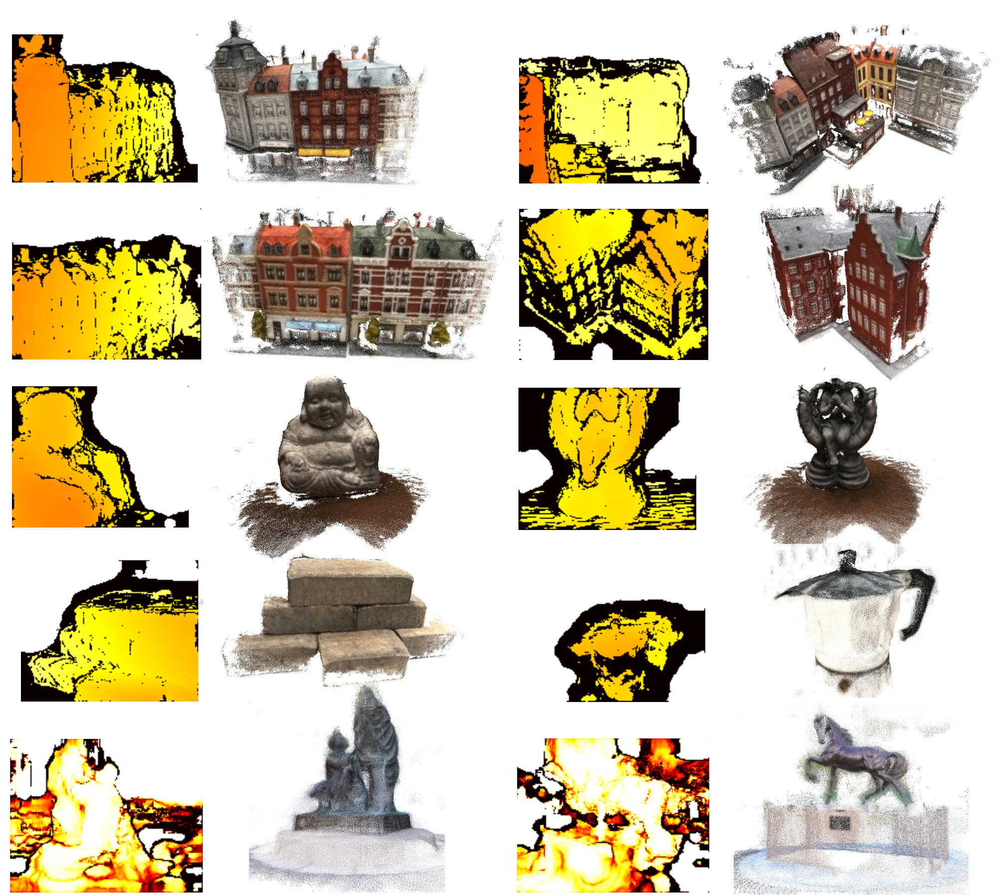

​	无监督深度学习方法不仅在重建质量上有较高的保证，同时有效克服了传统方法低性能和有监督学习方法强烈依赖数据集的问题，有着充分的可泛化性与广阔的可发展性。

​	综上，本文方法是一种具有鲁棒光度一致性的基于无监督深度学习的多视点三维重建方法，笔者认为可以应用到土木工程场景三维重建问题上。

 

## 6.2 未来工作展望

​	经过实验测试和同多种优秀方法的对比评估，本文中基于无监督深度学习多视点三维重建方法得到了实验的检验，基本达到了本文所提出的目标。但三维重建问题仍“任重而道远”，本文仍存在一些不足之处需要弥补，也仍然后很大的提升空间需要进一步探索：

（1）关于土木工程场景数据集的扩展。笔者所做无监督方法虽不需要依赖具有真值的数据集，但由于无监督学习方法本身的特点，需要更加庞大规模的数据集进行训练，尤其是针对土木工程场景的“专有”数据集。笔者了解到如BlendedMVS[36]等大规模场景数据集已经有极好的应用范例，但土木工程场景的大规模数据集仍然较为稀有，也进一步造成基于深度学习的三维重建方法目前在土木工程领域很少被使用的现象。

（2）关于无监督深度学习网络优化。本文在整体网络架构上并未同MVSNet进行大规模修改，但在笔者进行无监督网络修改时已有很多优秀的改进思路对基于深度学习的MVS方法进行进一步发展和完善。尤其是笔者认为现有方法普遍将不同视点的原始图像同等对待，但在损失回归和网络的训练中不同图像甚至是同一视点图像的不同图像块的贡献度都不尽相同。

（3）关于重建后点云的处理与BIM逆向建模。从结果点云中也不免看到现阶段的方法经过稠密重建后仍会有部分离群值和噪声，这对于表面重建、点云转换为BIM模型是“致命伤”。因此经过无监督深度学习方法输出的稠密点云仍需经过适当处理以达到平整、光滑、精细等方面的要求。

​	综上所述，在三维重建领域的相关研究仍有很多值得扩展和深入探索的方面，同时如何将三维重建技术应用到土木工程场景中也需要不断探索与优化。

-----

# 参考文献

[1]	刘占省,赵明,徐瑞龙. BIM技术在建筑设计、项目施工及管理中的应用[J].建筑技术开发,2013,40(3):65-71.    
[2]	张冰,李欣,万欣欣.从数字孪生到数字工程建模仿真迈入新时代[J].系统仿真学报,2019,31(03):369-376.   
[3]	石力文,侯妙乐,胡云岗,李爱群,解琳琳.基于点云数据与BIM的古建筑三维信息表达方法研究[J].遗产与保护研究,2018,3(07):46-52.   
[4]	缪盾,吴竞,张广兴.BIM结合三维激光扫描在建筑中的应用[J].低温建筑技术,2017,39(05):133-134+143.   
[5]	李小飞,李赟,张林,王硕,钱海波.基于三维激光扫描的BIM技术在上海世茂深坑酒店方案优化中的应用[J].施工技术,2015,44(19):30-33.   
[6]	姚习红,徐晓雨,高志民.基于三维激光扫描的BIM技术在武汉绿地中心钢结构项目中的应用[J].钢结构,2018,33(08):118-121.   
[7]	Yao Y, Luo Z, Li S, et al. Mvsnet: Depth inference for unstructured multi-view stereo: Proceedings of the European Conference on Computer Vision[C], 2018: 767-783.   
[8]	Schonberger J L, Frahm J M. Structure-from-motion revisited: Proceedings of the IEEE conference on computer vision and pattern recognition[C], 2016: 4104-4113.   
[9]	Schönberger J L, Zheng E, Frahm J M, et al. Pixelwise view selection for unstructured multi-view stereo: European Conference on Computer Vision. Springer[C], Cham, 2016: 501-518.   
[10] Han X, Leung T, Jia Y, et al. Matchnet: Unifying feature and metric learning for patch-based matching: Proceedings of the IEEE Conference on Computer Vision and Pattern Recognition[C], 2015: 3279-3286.   
[11] Zbontar J, LeCun Y. Stereo matching by training a convolutional neural network to compare image patches[J]. J. Mach. Learn. Res., 2016, 17(1): 2287-2318.   
[12] Luo W, Schwing A G, Urtasun R. Efficient deep learning for stereo matching: Proceedings of the IEEE conference on computer vision and pattern recognition[C], 2016: 5695-5703.   
[13] Kendall A, Martirosyan H, Dasgupta S, et al. End-to-end learning of geometry and context for deep stereo regression: Proceedings of the IEEE International Conference on Computer Vision[C], 2017: 66-75.   
[14] Ji M, Gall J, Zheng H, et al. Surfacenet: An end-to-end 3d neural network for multiview stereopsis: Proceedings of the IEEE International Conference on Computer Vision[C], 2017: 2307-2315.   
[15] Kar A, Häne C, Malik J. Learning a multi-view stereo machine[J]. arXiv preprint arXiv:1708.05375, 2017.   
[16] Yao Y, Luo Z, Li S, et al. Recurrent mvsnet for high-resolution multi-view stereo depth inference: Proceedings of the IEEE/CVF Conference on Computer Vision and Pattern Recognition[C], 2019: 5525-5534.   
[17] Chen R, Han S, Xu J. Visibility-aware point-based multi-view stereo network[J]. IEEE transactions on pattern analysis and machine intelligence, 2020.   
[18] Gu X, Fan Z, Zhu S, et al. Cascade cost volume for high-resolution multi-view stereo and stereo matching: Proceedings of the IEEE/CVF Conference on Computer Vision and Pattern Recognition[C], 2020: 2495-2504.   
[19] Godard C, Mac Aodha O, Brostow G J. Unsupervised monocular depth estimation with left-right consistency: Proceedings of the IEEE Conference on Computer Vision and Pattern Recognition[C], 2017: 270-279.   
[20] Kuznietsov Y, Stuckler J, Leibe B. Semi-supervised deep learning for monocular depth map prediction: Proceedings of the IEEE conference on computer vision and pattern recognition[C], 2017: 6647-6655.   
[21] Ipeirotis P G, Provost F, Wang J. Quality management on amazon mechanical turk: Proceedings of the ACM SIGKDD workshop on human computation[C], 2010: 64-67.   
[22] Barnes C, Shechtman E, Finkelstein A, et al. PatchMatch: A randomized correspondence algorithm for structural image editing[J]. ACM Trans. Graph., 2009, 28(3): 24.   
[23] Lepetit V, Moreno-Noguer F, Fua P. Epnp: An accurate o (n) solution to the pnp problem[J]. International journal of computer vision, 2009, 81(2): 155.   
[24] Hartley R, Zisserman A. More Single View Geometry[J]. Multiple view geometry in computer vision, 2003: 205,216-219.   
[25] Collins R T. A space-sweep approach to true multi-image matching: Proceedings CVPR IEEE Computer Society Conference on Computer Vision and Pattern Recognition[C]. IEEE, 1996: 358-363.   
[26] Hartmann W, Galliani S, Havlena M, et al. Learned multi-patch similarity: Proceedings of the IEEE International Conference on Computer Vision[C], 2017: 1586-1594.   
[27] Ronneberger O, Fischer P, Brox T. U-net: Convolutional networks for biomedical image segmentation: International Conference on Medical image computing and computer-assisted intervention[C]. Springer, Cham, 2015: 234-241.    
[28] Zhou T, Brown M, Snavely N, et al. Unsupervised learning of depth and ego-motion from video: Proceedings of the IEEE conference on computer vision and pattern recognition[C], 2017: 1851-1858.   
[29] Mahjourian R, Wicke M, Angelova A. Unsupervised learning of depth and ego-motion from monocular video using 3d geometric constraints: Proceedings of the IEEE Conference on Computer Vision and Pattern Recognition[C], 2018: 5667-5675.   
[30] Jaderberg M, Simonyan K, Zisserman A, et al. Spatial transformer networks[J]. arXiv preprint arXiv:1506.02025, 2015.   
[31] Geiger A, Lenz P, Urtasun R. Are we ready for autonomous driving? the kitti vision benchmark suite: 2012 IEEE Conference on Computer Vision and Pattern Recognition[C]. IEEE, 2012: 3354-3361.   
[32] Cignoni P, Callieri M, Corsini M, et al. Meshlab: an open-source mesh processing tool: Eurographics Italian chapter conference[C], 2008: 129-136.   
[33] Jensen R, Dahl A, Vogiatzis G, et al. Large scale multi-view stereopsis evaluation: Proceedings of the IEEE conference on computer vision and pattern recognition[C], 2014: 406-413.   
[34] Aanæs H, Jensen R R, Vogiatzis G, et al. Large-scale data for multiple-view stereopsis[J]. International Journal of Computer Vision, 2016, 120(2): 153-168.   
[35] Knapitsch A, Park J, Zhou Q Y, et al. Tanks and temples: Benchmarking large-scale scene reconstruction[J]. ACM Transactions on Graphics (ToG), 2017, 36(4): 1-13.   
[36] Yao Y, Luo Z, Li S, et al. Blendedmvs: A large-scale dataset for generalized multi-view stereo networks: Proceedings of the IEEE/CVF Conference on Computer Vision and Pattern Recognition[C], 2020: 1790-1799.   
[37] 周飞燕,金林鹏,董军.卷积神经网络研究综述[J].计算机学报,2017,40(06):1229-1251.   
[38] 殷瑞刚,魏帅,李晗,于洪.深度学习中的无监督学习方法综述[J].计算机系统应用,2016,25(08):1-7.   
[39] Galliani S, Lasinger K, Schindler K. Massively parallel multiview stereopsis by surface normal diffusion: Proceedings of the IEEE International Conference on Computer Vision[C], 2015: 873-881.   
[40] Khot T, Agrawal S, Tulsiani S, et al. Learning unsupervised multi-view stereopsis via robust photometric consistency[J]. arXiv preprint arXiv:1905.02706, 2019.   
[41] Moulon P, Monasse P, Perrot R, et al. Openmvg: Open multiple view geometry: International Workshop on Reproducible Research in Pattern Recognition[C]. Springer, Cham, 2016: 60-74.   
[42] Aanæs H, Jensen R R, Vogiatzis G, et al. Large-scale data for multiple-view stereopsis[J]. International Journal of Computer Vision, 2016, 120(2): 153-168.   
[43] Snavely N, Seitz S M, Szeliski R. Modeling the world from internet photo collections[J]. International journal of computer vision, 2008, 80(2): 189-210.   
[44] Zhou Q Y, Park J, Koltun V. Open3D: A modern library for 3D data processing[J]. arXiv preprint arXiv:1801.09847, 2018.   
[45] Naveenkumar M, Domnic S. Deep ensemble network using distance maps and body part features for skeleton based action recognition[J]. Pattern Recognition, 2020, 100: 107125.   
[46] 李平伯.基于双目和结构光的弱特征SLAM研究[D].江苏:东南大学,2019.   
[47] 李迎松.摄影测量影像快速立体匹配关键技术研究[D].武汉:武汉大学,2018   

-----

# 谢辞

​	匆匆间，大学四年生活就悄然划过了，站在时间尽头回看过往的一切不免感叹。毕业设计虽作为大学生活最后的句号，但却是今后科研路上的起点。这也是第一次以纯学术的方法完成一篇论文，其中的艰辛自不必说，非常感谢一路上帮助我的所有人。

​	感谢我未来研究生导师，北京大学王荣刚老师，通过进组后的几次组会让我开始接触到深度估计和三维重建领域并以此作为毕业设计；感谢学院张荣庆老师有条不紊地指导我完成开题、中期、论文等一些列步骤；感谢土木工程学院卢昱杰找到我并将我的毕业设计与土木工程领域进行结合，同时提供科研环境让我搭建实验，我也十分荣幸能与同济王牌学科进行学术融合。

​	我也想对一路上给我建议并给予我帮助的邱轲师兄、赖雅雯师兄、苏昭帆学姐、谈瑞学长、徐哲涵学长等学长学姐表达由衷的感谢，你们通过各自的方式在科研路上引领我前进，未来我也会继续传承下去。同时也感谢陪我一同奋战的室友和朋友们，我们互相支持的路上永远不孤独。
​	最后想感谢我的爸妈，做毕设这段时间压力很大，陪你们聊天的时间比以前少了一些，但每次在视频里看到你们还是感觉无比幸福，你们也还是会跟我分享很多人生经验缓解我紧张的神经。大学四年在外求学，回家的日子屈指可数，未来几年的研究生离家更远，南北相望，希望你们继续活出自己简单的快乐。
​	还想留给自己一个词，“初心”。希望你能始终记得自己千辛万苦得到的解释，初学者的心态。别忘了你是怎么来的，然后再继续走下去。
​	“夫吴人与越人相恶也，当其同舟共济，遇风，其相救也，如左右手”。这句写在录取通知书上的话我会终生铭记，感谢四年里同济对我的培养。追求卓越的路上永远没有尽头，同济，不说再见。
